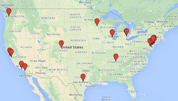

## About

[hackEDU](http://hackedu.us) is a non-profit initiative that works with high
school students to start and lead programming clubs at their schools. We
provide all the tools for starting and leading clubs including a baseline
coding curriculum, free software tools, and community building training.

## Metrics

##### Fall 2014 Pilot

- 24 clubs in 11 states and two countries
- over 1000 members
  - 35% women (double the national average of 18%)
  - 18% minority ethnicities in technology (three times the national average 5%)

##### What our hackers have been up to

At the top two collegiate hackathons in the world, [PennApps
X](http://2014f.pennapps.com/) and [MHacks
V](http://mhacksv.challengepost.com/), half of the six winning teams were led
high school students. All of these winning high school teams are part of
hackEDU.

Most recently, [Rohith Varanasi](http://rohithvaranasi.com/), one of our club
leaders from South Brunswick High School, and the rest of his team from [MHacks
IV](http://mhacks-iv.challengepost.com/) were named the [Major League Hacking +
Thiel 2014 Rookie of the
Year](http://news.mlh.io/cosmos-thiel-rookie-year-2014-mlh-fall-season-02-09-2015)
for creating [Cosmos
Browser](http://www.androidauthority.com/cosmos-browser-sms-data-connection-526654/).
Another one of our leaders, [Raphael Kats](http://raphaelrk.com/), created
[DataWave](http://challengepost.com/software/datawave), another data-less
browser using radio waves at MHacks V and won 2nd place.
