# Remote Control

_Questions, comments and critiques are welcome! Send your feedback
[here](https://docs.google.com/forms/d/1IxbiDtyP-UOx3hRGu3o2I-iVll95xQ6I_pW8JS3TZ2k/viewform)._

The objective of this workshop is to learn to wield powerful
[APIs](http://www.quora.com/What-is-an-API) with minimal code.

**For Beginners**

You will learn how to do really cool things with really simple code. You won't
understand how it all works and that's totally cool. Your objective is to learn
how to make things happen. Later you can come back and figure out how it all
works.

**For More Experienced Folk**

This tutorial will likely show you things that you didn't know that you could
do. I'd recommend skipping around in the tutorial and find what strikes your
interest.

## Partners

Before starting this workshop, find a partner! You'll be pair
programming!

## Quick Demo

We're going to write some code that calls your phone and speaks some
text.

Ready?

Open [this JS Bin](http://jsbin.com/papawo/20/edit?html,js,console)*. Leave this
tab open for the rest of the tutorial.

_*JS Bin is a website to easily write code for websites._

### Adding Your Twilio SID and Token

We are going to use a service called Twilio to do things like send text messages
and make phone calls.

To add this capability to any HTML file, just add this script tag inside the
bottom of your body tag:

```html
<script src="//bit.ly/twilio-basic-v6"
  sid="YOUR_TWILIO_ACCOUNT_SID_HERE"
  token="YOUR_TWILIO_AUTH_TOKEN_HERE"
></script>
```

You can see this snippet of code inside the HTML tab of the JS Bin:

> 

Before this will work though we need to change `"YOUR_TWILIO_ACCOUNT_SID_HERE"`
and `"YOUR_TWILIO_AUTH_TOKEN_HERE"` to your actual Twilio SID and token.

The facilitator should have given you an SID and a token. If you don't have one
yet, ask your facilitator.

If you are the facilitator (or you're just doing this workshop by yourself),
follow the directions [here](../lib/twilio-basic/signup.md) to get your own
Twilio SID and token.

Once we have the SID and auth token, replace
`YOUR_TWILIO_ACCOUNT_SID_HERE` and `YOUR_TWILIO_AUTH_TOKEN_HERE` with the actual
Account SID and Auth Token.

> 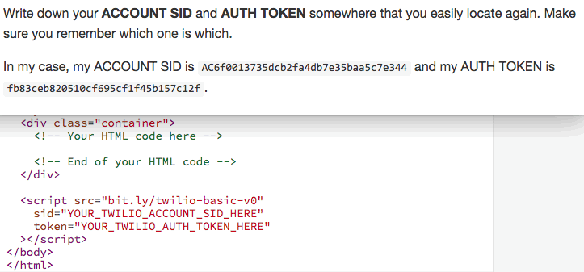

### Writing the One Line of Code to Send a Text Message

Then type the below code into the left side of JS Bin _exactly_:

```js
Twilio.callAndSay("555-555-5555", "You just subscribed to Gossip Girl");
```

_**Don't forget the parentheses commas, and quotation marks.**_

> 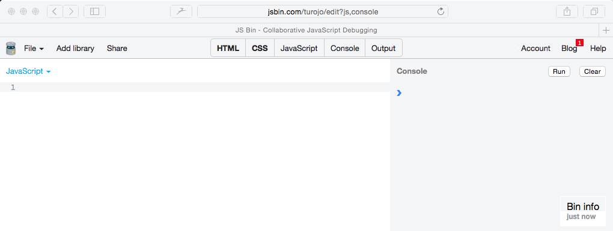

This code calls the phone number `555-555-5555` and says the message
`Gossip Girl here, your one and only.` We don't want that.

Change `555-555-5555` to your own phone number. Feel free to change the
message too.

> 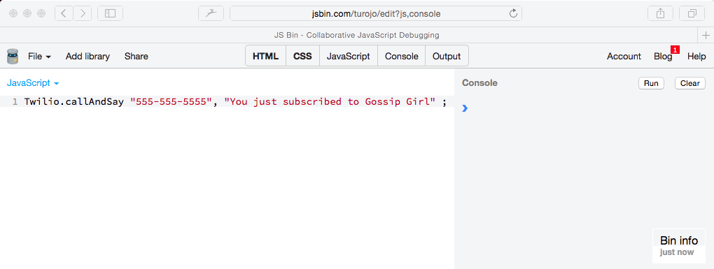

Now go ahead and press the "Run" button.

> 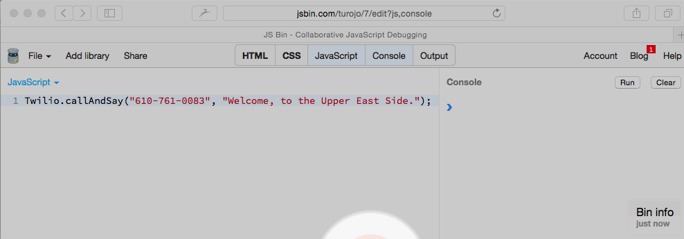

Your phone should ring shortly! Answer it!

_If it doesn't work, ask a neighboring group to see if they can see what's
wrong. Otherwise, raise your hand to ask a facilitator for help!_

### Having Some Fun

If you want, you can now duplicate the code to call more people's phones! Ask
your neighbors for their phone number!

> 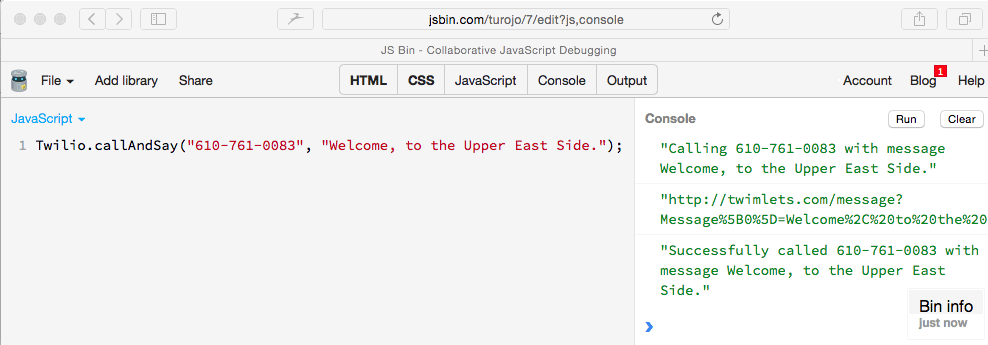

Go ahead and click run!


## Outline for the Rest of This Tutorial

### Part I

This first section is linear and more guided.

In this section, you will learn to build an HTML5 app that, when you press a
a button, it will call a phone.

[Here is a demo of the app we will make](http://jsbin.com/fawuda/86/edit?js,console,output).
To make this work for you:

1. make sure you change change `555-555-5555` to your phone number
2. click the "Run with JS" button in the output and enter your Twilio SID and
   token

Here is an outline of what you'll learn on the way:

1. [Send text messages and make phone calls with one line of code]
   (#send-text-messages-and-make-phone-calls)
2. [Creating an account on JS Bin](#saving-our-work)
3. [Call a phone when a button is clicked]
   (#call-a-phone-when-a-button-is-clicked)

If you're more advanced, feel free to skip this section and go to the next. Do
make sure that you create a JS Bin account first though (you can sign in with
GitHub).

### Part II

This section is less guided. It showcases snippets of various APIs and how to
use them.

With your partner, look around to see what snippets you think are cool.
Pick and choose some of them to build a mini project!

We can break the tools into two categories:

**Actions**

Actions are just actions:

- Send a text message (addressed above)
- Call a phone and have a computer voice say something (addressed above)
- Call a phone and play music
- Play music through the web page

**Triggers**

Triggers run any code you want WHEN something happens. For example, you can
run code:

- When a button is pressed
- When the phone is "waved" like a magic wand
- When you receive a text message

## Part I

### Send text messages and make phone calls

Go ahead and continue using the
[JS Bin from the Quick Demo](http://jsbin.com/papawo/25/edit?html,js,console).

If you've closed it already, open
[the JS Bin](http://jsbin.com/papawo/25/edit?html,js,console)
back up!

If you havn't added your Twilio SID and token to this JS Bin, please do that
by [following these directions](#adding-your-twilio-sid-and-token).

We've already learned how to make a phone call and say something in the
[Quick Demo](#quick-demo).

Let's learn how to send text messages and call phones that play music.

#### Sending Text Messages

Type the below code as it is written _exactly_ in the JS Bin:

```js
Twilio.sendMessage("555-555-5555", "Evening upper east siders...");
```

First change `555-555-5555` to your own phone number. Feel free to change the
message too.

> 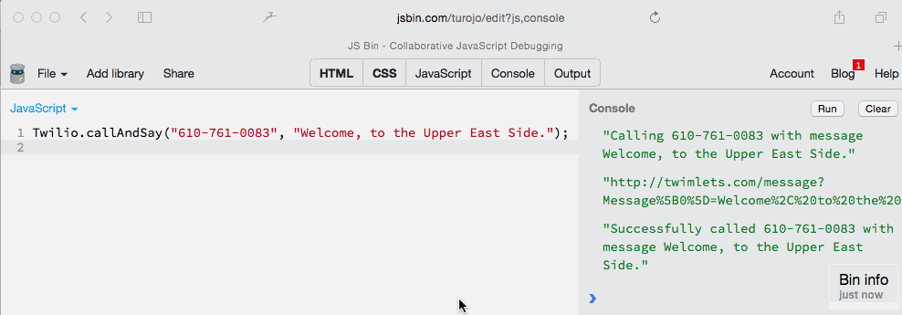

Go ahead and click "Run" again.

> 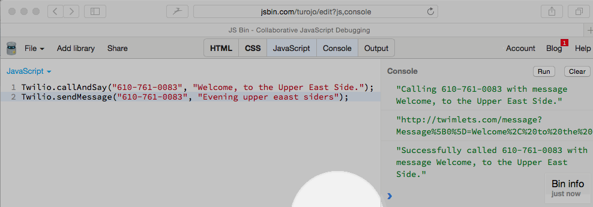

Because I left the code that calls my phone, I get a phone call as well
as a text message.

> If it doesn't, ask a neighboring group to see if they can see what's wrong.
> Otherwise, raise your hand to ask a facilitator for help!


### Saving Our Work

Huzzah! We did it! We're done! Now we need to save our work!

To do that, we must create a JS Bin account first.

```
Important Facilitation Note

Make sure that BOTH you and your partner, do the below steps individually.
After signing up for all the accounts, then you can pair again.
```

#### Creating a JS Bin Account

When we click "Login or Register"

> 

We see that we can "Login or Register via GitHub".

Think about this like Facebook Login, except it is GitHub login.

What is GitHub?

It is a website used by many coders to collaborate on code. Think Dropbox, but
for code.

Let's make a GitHub account!

_If you already have a GitHub account, feel free to
[skip this step](#call-a-phone-when-a-button-is-clicked)._

#### Creating a GitHub account

**In a new window, open [https://github.com](https://github.com)**

> 

**Create an account with a valid email**

> 

**Click "Sign up for GitHub"**

> 

**Login with GitHub**

Now that you have a GitHub account, you can login with GitHub

> 

Great! We now have our own JS Bin and GitHub accounts!

**Next**

We learned how to call a phone and send a text message.
Now let's make this work when I press a button on a real website!

### Call a Phone When a Button is Clicked

**Important:** Go ahead and open up
[this new JS Bin](http://jsbin.com/fawuda/139/edit?html,js,console,output)and
[add your Twilio credentials like before as well](#adding-your-twilio-sid-and-token).

There are 4 panels in the JS Bin now:

> 

To show or hide a tab, just click the tab:

> 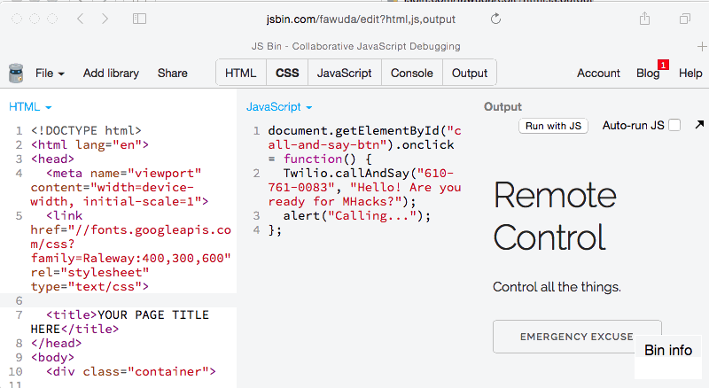

Before you do anything, in the JavaScript tab, change the `555-555-5555` phone
number to your number.

> 

Then click the checkbox for "Auto-run JS"

> 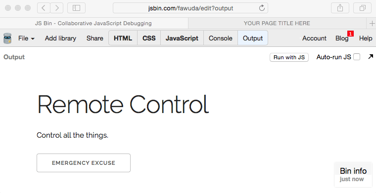

When you click the button that says "Emergency Excuse", it will call your phone
and say "Hello! Are you ready for MHacks?" (Ths feature might come in handy when
you are on an awkward date and you need your phone to ring...)

Go ahead and click the "Emergency Excuse" button:

> 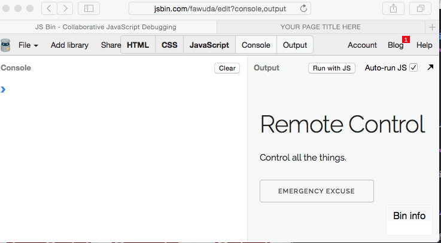

If it doesn't, ask a neighboring group to see if they can see what's wrong.
Otherwise, raise your hand to ask a facilitator for help!

#### Trying to Understand the Code

There are two pieces of code that make this work, the code in the HTML:

```html
<button id="emergency-button">Emergency Excuse</button>
```

located here:

> 

And the code in the JavaScript:

```js
document.getElementById("emergency-button").onclick = function() {
  Twilio.callAndSay("555-555-5555", "This is your boss! Get over here!");
  alert("Calling...");
};
```

With your partner (and maybe some neighbors), spend just 1-2 minutes trying to
talk through how you think this code works. (Hint: say the JavaScript out loud
**slowly**...)

#### Understanding the Code

Instead of explaining how the existing code works, I will explain by going
through the process of adding another button. When I press this new button, it
will call me and say "Time to wake up! Keep hacking! Just do it!".

##### Adding the Button

In the HTML let's add another button by writing:

```html
<button>Motivate Partner</button>
```

> 

<!--Result-->

##### Adding an Id to the Button

Then we need to give this button an id so we can refer to it by its id in the
JavaScript.

```html
<button id="motivation-button">Motivate Partner</button>
```

> 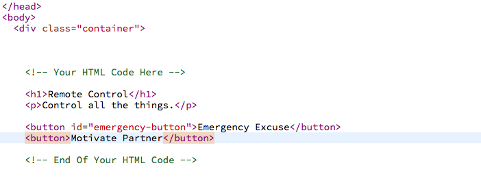

##### Referencing the Button from JavaScript

Now that we set the button's id, we add this to our JavaScript:

```js
document.getElementById("motivation-button").onclick = function() {
  [PUT ANY CODE HERE YOU WANT WHEN THE BUTTON IS CLICKED]
};
```
_Don't include the `[PUT ANY CODE HERE YOU WANT WHEN THE BUTTON IS CLICKED]`_

> 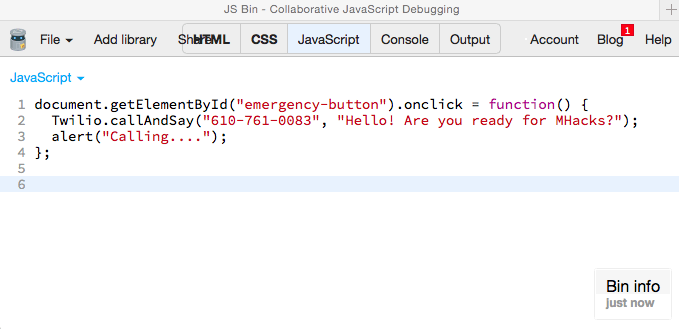

There is a lot to understand in the above code but if you read it out loud like
this, it might begin to make sense:

_Note that I highlighted the keywords from the code_

In the `document`, `get` the `element` with the `id` `"motivation-button"` and
when it is `clicked`, run any of the code that is inside the `function`.

There are definitely more concepts and complexities here but we won't worry
about them in this workshop. If you want to read more about what's happening
here, feel free to Google `javascript function` and `document.getElementById`
and/or ask a facilitator!

##### Adding an Alert

Now we can add the code inside of the `function`.

Let's add what's called an `alert` to the JavaScript

```js
alert("You pressed the button");
```

> 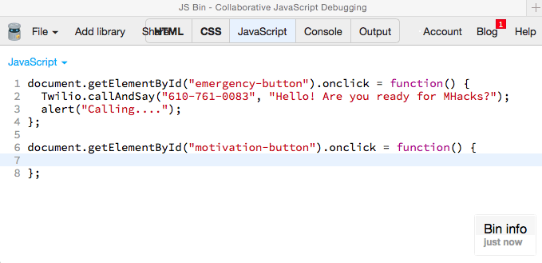

Now when you click the button, it should create a pop-up, but JS Bin blocks
them in this view. You'll need to click the black arrow to pop the output out:

> 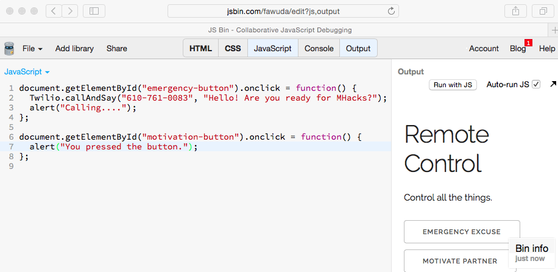

Now click the `Motivate Partner`

> 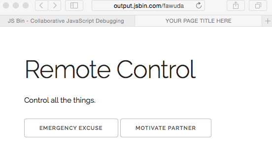

_If it doesn't work, ask a neighboring group to see if they can see what's
wrong. Otherwise, raise your hand to ask a facilitator for help!_

##### Adding the Actual Code to Make the Phone Call:

Let's add the phone calling functionality.

Don't forget to change the `555-555-5555` phone number to your own.

```js
document.getElementById("dead-people-btn").onclick = function() {
  Twilio.callAndSay("555-555-5555", "Time to wake up! Keep hacking!");
  alert("You pressed the button.");
};
```

> 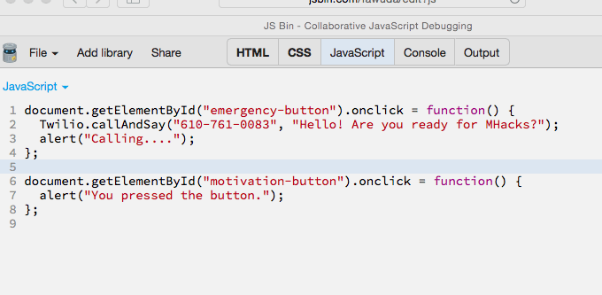

If you try pressing the `Motivate Partner` button, you should get a phone call!

_If it doesn't work, ask a neighboring group to see if they can see what's
wrong. Otherwise, raise your hand to ask a facilitator for help!_


#### Trying it out on mobile

Just click "Share" and then "Output only" to get the URL

> 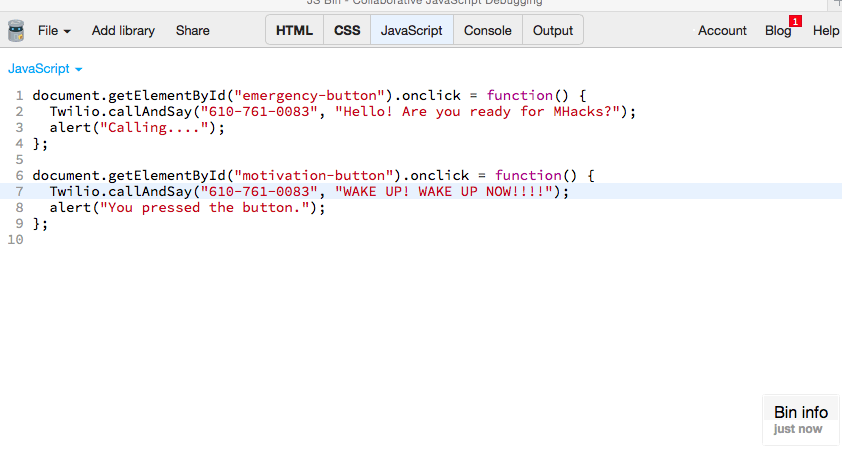

Then type in the URL into your mobile browser. (You can also be clever and
write a line of code to send the URL to your phone with a text message).

### The final code

Here's what [my code looks like]
(http://jsbin.com/fawuda/150/edit?html,js,console,output)
right now. In order for this example to work:

- Change the phone number to your phone number.
- Set your twilio api key and token using
  [the instructions here](#adding-your-twilio-sid-and-token).

## Part II

### Making the examples work

**IMPORTANT:**

All the examples also need to have a Twilio SID and authentication token.
However they use a different script than the above. To make the examples work
for the rest of the tutorial follow these instructions:

- Open [this JS Bin](http://jsbin.com/tetisa/1/edit?js,output).
- Click "Run with JS".
- When prompted, enter your Twilio SID and token.

> 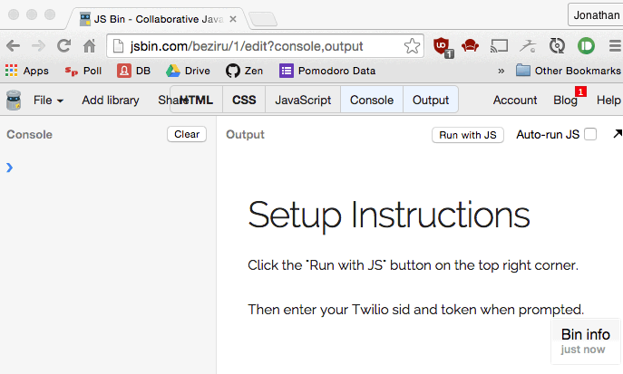

### Actions

#### Call and Play Music Through Phone

```js
Twilio.callAndPlay("555-555-5555", "http://a.tumblr.com/tumblr_lie8ewfdbO1qzbwpvo1.mp3");
```

[JS Bin](http://jsbin.com/fawuda/101/edit?js,console)

_(Don't forget to change the phone number and click the "run" button._

#### Play Music Through Your Computer

```js
var audio = new Audio("http://a.tumblr.com/tumblr_lie8ewfdbO1qzbwpvo1.mp3");
audio.play();
```

[JS Bin](http://jsbin.com/fawuda/101/edit?js,console)

_If you're trying to play a sound on mobile, it must be activated with a button
press first before it can play._

### Triggers

#### Magic Wand

When the mobile phone is waved like a magic wand, have it trigger something.

First include this javascript library at the bottom of the HTML page in an
existing JS Bin:

```html
<script type="text/javascript" src="//bit.ly/wand_js"></script>
```

> 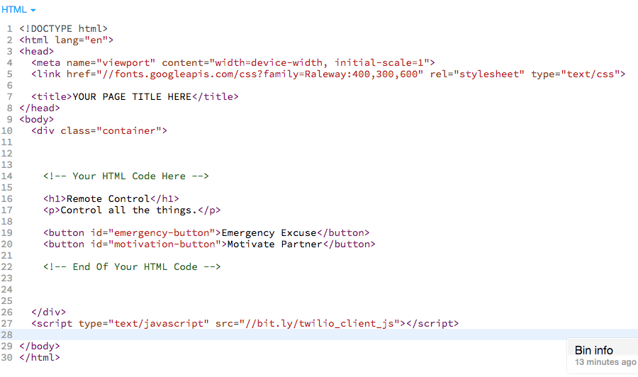

Then add this code in the JavaScript

```js
Wand.threshold = 5;
Wand.onWave = function() {
  alert("Wand Waved");
  // INSERT CODE HERE YOU WANT TO RUN WHEN YOU WAVE THE WAND
};
```

> 

Adjust

```js
Wand.threshold = 5;
```

The larger the number, the harder you have to fling the wand in order for it to
trigger.

For an iPhone 6, I personally like
```js
Wand.threshold = 20;
```

**Important Note**

You will need to open the output view of JS Bin on your phone. After you do that
try waving your phone around.

Also note that the below JS Bins do not have the Twilio library in them. If you
want them, you'll have to add it by added the following at the bottom of the
body tag in the HTML

```js
<script src="//bit.ly/twilio-basic-v6"
  sid="YOUR_TWILIO_ACCOUNT_SID_HERE"
  token="YOUR_TWILIO_AUTH_TOKEN_HERE"
></script>
```

- [Here is a bare bones working example](http://jsbin.com/fawuda/145/edit?js,output
- [This is the output URL](http://jsbin.com/fawuda/145)

Here is a more complicated example

- [link to the code](http://jsbin.com/fawuda/151/edit?html,js,output)
- [link to the output that you should open on your phone]
  (http://jsbin.com/fawuda/151)

**Important Note** that for waving the wand to play a sound, you need to press
the button on your phone to play the sound first before the wand will work
because of an iOS limitation ( a sound won't play until it is played at least
once from pressing or clicking something). [Here is the output URL that you want
to open on your phone.

#### When you receive a text message

```js
Twilio.listenForMessages(function(data) {
  alert("I received an SMS from " + data.from);
  alert("They said " + data.body);
});
```

[Here is an example JS Bin](http://jsbin.com/hisavu/4/edit?html,js,console)
with the above code.

These are all the properties that you can receive:

```json
{
    "toCountry": "US",
    "toState": "PA",
    "smsMessageSid": "SMe182077e5d6045773c289815dcca25fd",
    "numMedia": "0",
    "toCity": "NORRISTOWN",
    "fromZip": "19486",
    "smsSid": "SMe182077e5d6045773c289815dcca25fd",
    "fromState": "PA",
    "smsStatus": "received",
    "fromCity": "NORRISTOWN",
    "body": "Yo",
    "fromCountry": "US",
    "to": "14846854323",
    "toZip": "19406",
    "numSegments": "1",
    "messageSid": "SMe182077e5d6045773c289815dcca25fd",
    "accountSid": "AC0a9665bd93b240f6ad384761b3e3b47c",
    "from": "16107610083",
    "apiVersion": "2010-04-01"
}
```

And then you can do cool stuff like whenever you text the Twilio phone number,
it will call you and say over the phone whatever you texted it. To find out the
Twilio phone number to text, look in the JS Bin console.

```js
Twilio.listenForMessages(function(data) {
  Twilio.sendMessage(data.from, "You said '" + data.body + "'");
});
```

See the above code working in [this JS Bin](http://jsbin.com/hisavu/8/edit?html,js,console).

```js
Twilio.listenForMessages(function(message) {
  Twilio.callAndPlay(message.from, "http://www.nyan.cat/music/original.mp3");
});
```

See the above code working in [this JS Bin](http://jsbin.com/fawuda/111/edit?js,console).

You can start to do more advanced logic like implementing a chat bot.
