# Ajar.io

-------------------------------------------------------------------------------

[Agar.io](http://agar.io) is a popular game built for the web with
[HTML, CSS, and Javascript](http://qr.ae/RoCXc7). The goal of this workshop is
to teach you to make your own simplistic version of agar.io which we'll call
ajar.io.

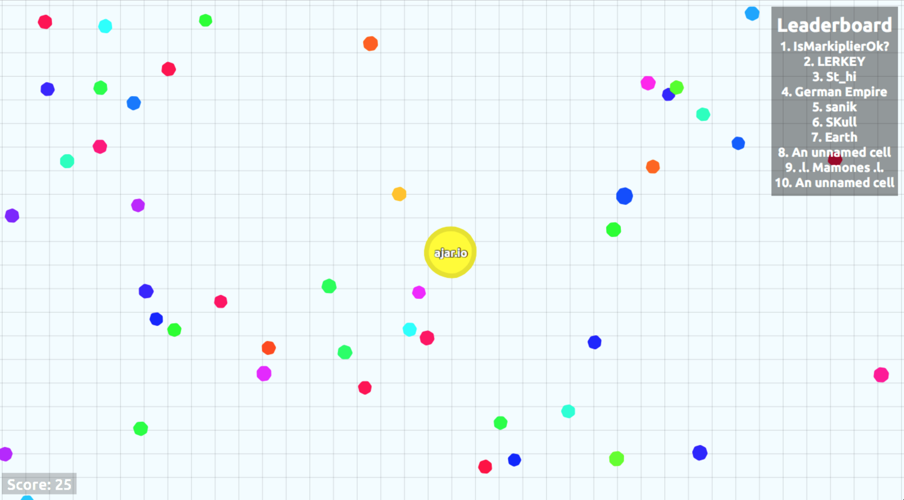

The workshop will be divided into several parts (check indicates workshop has
been written):

- [x] [__Part 1__](#part-1) - Display the user's cell on screen.
- [x] [__Part 2__](#part-2) - Convert the code from part 1 to use functions.
- [x] [__Part 3__](#part-3) - Make the user's cell follow the mouse cursor.
- [x] [__Part 4__](#part-4) - Add velocity to the cell's movements.
- [x] [__Part 5__](#part-5) - Generate hardcoded food.
- [ ] __Part 6__ - Randomly generate food.

__More coming soon...__

## Tips And Tricks

1. To open a link in another tab, right click on the link and select `Open In
   New Tab`.
2. When copying code from this workshop to your project try retyping the code
   yourself instead of using your copy-pasting shortcuts. Forcing yourself to
   read through the code as you retype it can help increase your understanding.

## Part 1

In this part you're going to learn to display the user's cell on-screen using
the [HTML `<canvas>` element](http://www.w3schools.com/html/html5_canvas.asp).

> The HTML `<canvas>` element is used to draw graphics, on the fly, via
> scripting (usually JavaScript).

> The `<canvas>` element is only a container for graphics. You must use a script
> to actually draw the graphics.

> Canvas has several methods for drawing paths, boxes, circles, text, and adding
> images.

> *--- from [W3C](http://www.w3schools.com/html/html5_canvas.asp)*

My the end of this part you'll have something that looks like this:


Check out the demo <a href="http://jsbin.com/jizoyo/edit?output"
target="_blank">here</a> ([JS Fiddle](http://jsfiddle.net/4j6od7hv/)).

### Creating the files

If you haven't already set up Cloud9, [click here](../cloud9/README.md) to be
taken to a guide on setting it up. Once you've done that, continue over here.

In Cloud9, create two files in a folder of your choice:

- index.html
- app.js

Your folder should look like this:

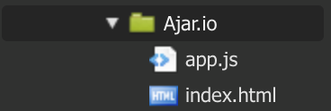

### Setting up the HTML

Type the below code as it is written *exactly* into your `index.html` file in
Cloud9 (no copy-pasting :p):

```html
<!DOCTYPE html>
<html>
<head>
	<title>Ajar.io</title>
</head>
<body>
</body>
</html>
```

Next, add the below `<canvas>` element inside of the `<body>` element.

```html
<canvas id="canvas" width="500px" height="500px"></canvas>
```


> #### Understanding the code

> `canvas` - The canvas element allows you to draw shapes and other visual
> elements on screen. Feel free to
> [read more about canvas](http://www.w3schools.com/html/html5_canvas.asp).

> `id` - To review, this *attribute*, which can be applied to any HTML element,
> allows you to use that element in your javascript.

> `width` - Specifies the width of the `<canvas>`, this time in pixels.

>  `height` - Specifies the height of the `<canvas>`, this time in pixels.

-------------------------------------------------------------------------------

Now we have to tell our HTML (`index.html`) to use our Javascript (`app.js`). In
our `index.html` file we add the following line inside of the the `<body>`
element (make sure it's at the end):

```html
<script type="text/javascript" src="app.js"></script>
```

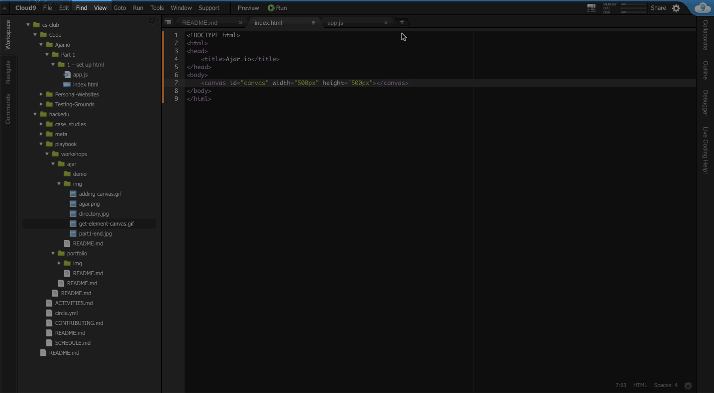

Your HTML is now configured!

### Writing the Javascript

The bulk of this workshop will take place in our the `app.js` file. If you
completed the previous section successfully, your `app.js` file should be linked
to your HTML (`index.html`).

Let's start by writing this line:

```js
var canvas = document.getElementById("canvas");
```

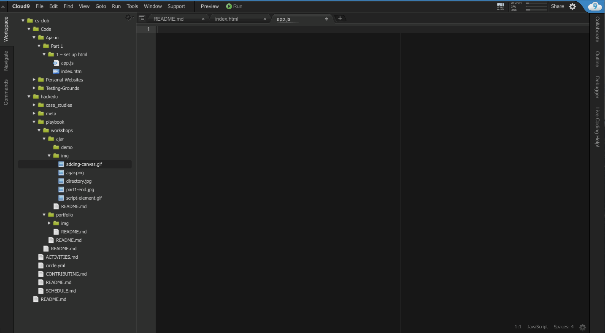

> #### Understanding the code

> `var` - Creates a variable named `canvas`. Variables are containers for
> storing data values. In this case `canvas` is used to reference the `<canvas>`
> element from your HTML.

> `document.getElementById("canvas")` - This function gets an element from your
> HTML that has the id you provide inside the quotes, in this case "canvas".
> Feel free to
> [read more about functions](http://www.w3schools.com/js/js_functions.asp).

> The `<canvas>` element retreived by `document.getElementById("canvas")` gets
> *assigned* to the variable `canvas`.

Next, write this line of code:

```js
var context = canvas.getContext("2d");
```

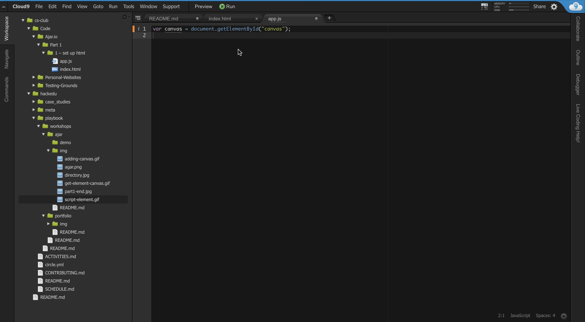

> #### Understanding the code

> You create another variable, this time named `context`. Don't worry too much
> about *what* `context` is, just know that we will be using it to draw shapes
> on the canvas.

Time to draw a circle! Open your `index.html` file and from the menu bar click
`Preview > Live Preview File (index.html)`.

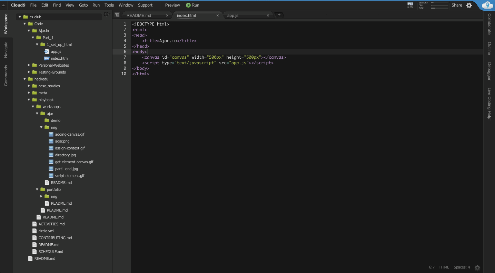

Now each time you save changes to your HTML or Javascript your site will refresh
to reflect the changes. Remember to *save* changes by going to `File > Save`.

Write the following lines at the end of your `app.js` file:

```js
context.beginPath();
context.arc(10, 10, 10, 0, 2*3.14159);
context.fill();
```

You should have something that looks like this.

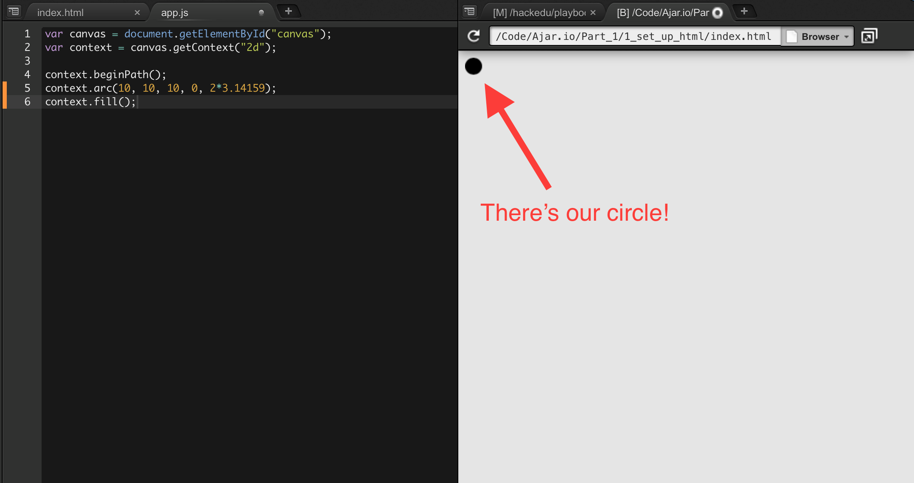

<a name="drawingArc"></a>
> #### Understanding the code

> `context.beginPath()` - Any shape on the canvas is considered a path. You need
> to call this function before begining to draw a new shape. In this case we are
> starting to draw a circle.

> `context.arc(10, 10, 10, 0, 2*3.14159)` - This function creates an arc. An arc
> that ends where it starts forms a circle. The function takes a lot of
> *arguments* (the items separated by commas) so let's look at each one. The
> order of the arguments goes as follows: `x, y, radius, startAngle, endAngle`.

> - The `x` and `y` (both 10 in this case) indicate where to position the center
>   of the arc. The top left corner of the canvas is considered (0, 0). Try
>   moving the circle to a different location by changing the `x` and `y`.

> - The `radius` (also 10) determines the radius of the arc. Try making the
>   circle a little larger by changing the `radius`.

> - The `startAngle` (0) determines at what angle the arc should start. The
>   angle is measured in
>   [radians](https://www.mathsisfun.com/geometry/radians.html). Briefly, 0
>   radians = 0 degrees and 2π radians = 360 degrees.

> - The `endAngle` (2*π) determins at what angle the arc should end. If the
>   `endAngle` is 2π radians, or 360 degrees, more than the `startAngle`, the
>   arc loops back into itself and forms a circle. Try making a semi-circle by
>   changing the `endAngle`.

> `context.fill()` fills the shape with a solid color. In this case the color is
> black.

Let's add some color! For this we write the following line directly above the
`context.fill` function:

```js
context.fillStyle = "cyan";
```


Woah! Our circle is now cyan.

> #### Understanding the code

> The fillStyle is a variable that deterimines the color that is used to fill
> the shape. [Many colors](http://www.w3schools.com/cssref/css_colornames.asp)
> are available, so try some on your own (like papayawhip).

When you've finished exploring, change the arguments of the `context.arc`
function to the following:

- `x`: 250
- `y`: 250
- `radius`: 40
- `startAngle`: 0
- `endAngle`: 2*3.14159

Your website should now look like this:


#### Congrats!

You've finished Part 1!


## Part 2

Welcome to part 2 of the Ajar.io workshop!

To recap, in [part 1](#part-1) you learned about:

- **JavaScript variables**: used to store data values. Declared using the `var`
  keyword. You can make variables like this:

```js
var x = 10 * 2;
var name = "Bogdan";
```

- **Drawing on the canvas**: the HTML `<canvas>` element is used to draw
  graphics, on the fly, via scripting (usually JavaScript). You obtain the
  drawing context of the `<canvas>` element by calling the _function_ (more on
  what that means today) `getContext("2d")` of the `<canvas>` element. You use
  the drawing context to draw shapes on the canvas.

In this part you will learn about **functions**.

### What are functions?

In part 1, you wrote all your code outside of any functions. This means that
your code runs from *top to bottom*. This was okay for a simple task such as
displaying one circle on screen. For more complex scenarios we will need
**functions**.

**A JavaScript function is a block of code designed to perform a particular
task.**

A function looks like this:

```js
function name() {
    // code to be executed goes here <-- That is a comment
}
```

A JavaScript function is defined with the `function` keyword, followed by a
name and a set of parentheses `()`. The code to be executed by the function is
placed inside curly brackets: `{}`.

You "run" a function (the code inside of it) by "invoking" the function.

You use an empty set of parentheses `()` to invoke the function. To invoke the
function `name` from above, you would write the code:

```js
name();
```

The code contained within the curly brackets `{}` would then be executed.

Unlike the code in part 1, **code contained in functions can be run multiple
times**.

Let's make another function.

```js
function addOne(myNumber) {
    myNumber = myNumber + 1;
}
```

This function's name is `addOne`.

But look! There's something inside of the parentheses. You can put
**parameters** inside function parentheses. Parameters are values you can give
to the function that the function can then use when executing it's code block.

In this function we give the function a number. The function can refer to this
number as `myNumber`.

The function proceeds to take the number (`myNumber`) and add one to it.

So how do we "invoke" this function? Like this:

```js
addOne(5);
```

The function thinks of `myNumber` as a variable whose value is `5`. It then
proceeds to run the code:

```js
myNumber = myNumber +1;
```

Because `myNumber` is 5, you can think of the computer seeing the code like
this:

```js
myNumber = 5 + 1;
```

So `myNumber` becomes `6`.

### Using functions in Ajar.

Right now your code should look like this:
> `Index.html`
> ```html
<!DOCTYPE html>
<html>
<head>
	<title>Ajar.io</title>
</head>
<body>
    <canvas id="canvas" width="500px" height="500px"></canvas>
    <script type="text/javascript" src="app.js"></script>
</body>
</html>
```

> `App.js`
> ```js
var canvas = document.getElementById("canvas");
var context = canvas.getContext("2d");
context.beginPath();
context.arc(x, y, 40, 0, 2*3.14159);
context.fillStyle = "cyan";
context.fill();
```

Let's modify our code to use functions. Go ahead and open your `index.html`
file and click on _preview_ in the menu bar and then _Live Preview File
(index.html)_. Now open your `app.js` file.

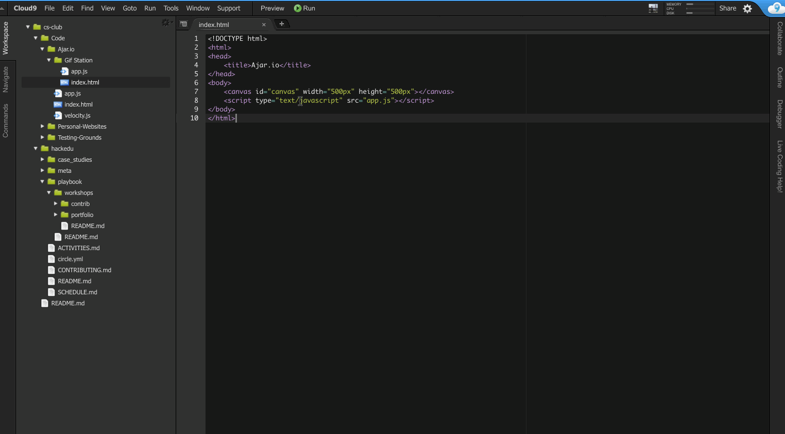

The first thing we want to do is to wrap these lines in a function:

```js
context.beginPath();
context.arc(250, 250, 40, 0, 2*3.14159);
context.fillStyle = "cyan";
context.fill();
```

We're going to make a new function called `drawUserCell` and place the lines
from above in it:

```js
function drawUserCell() {
    context.beginPath();
    context.arc(250, 250, 40, 0, 2*3.14159);
    context.fillStyle = "cyan";
    context.fill();
}
```

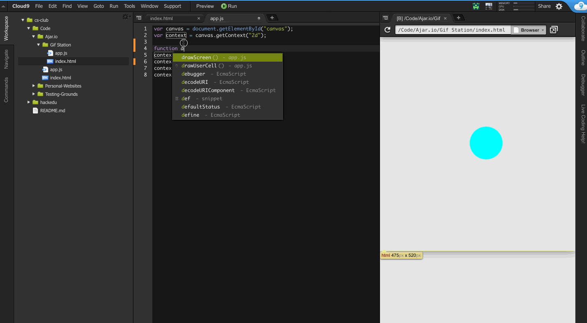

If you save the file now you'll see that there's no more circle on screen!

This is because we haven't "invoked" the function `drawUserCell`. Let's invoke
it. Type out the code below the `drawUserCell` function:

```
drawUserCell();
```

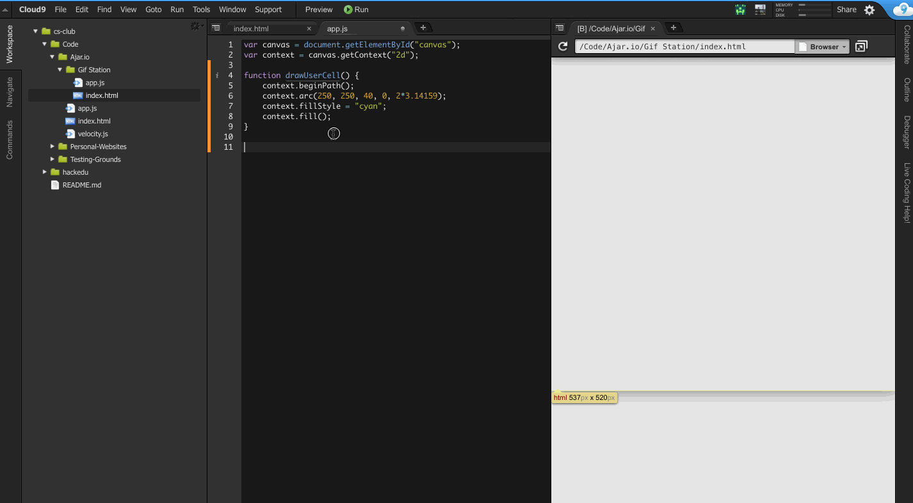

The circle is back!

#### Congrats!

You've finished Part 2!


## Part 3

Now that you know about functions let's move on to something more exciting! In
this part we will make the user's cell **move**.

This is how it's going to work:

1. Get the position (x and y) of the mouse cursor over the screen by adding
   an `EventListner` for `mousemove` to the `<canvas>` element.
2. Clear what's currently drawn on screen by overlaying a rectangle over the
   entire screen.
3. Draw the circle again this time at the new coordinates.

That's the order the computer will execute the code in, but not the order in
which we'll write the code.

### Draw circle based on variable values

In part 1 we hardcoded the `x` and `y` position of the circle:

```js
context.arc(250, 250, 10, 0, 2*3.14159);
            ^x  ^y
```

Since the position of our circle will _change_ those values have to be
variable. How do we make something variable? Oh right! Variables!

So we will make variables `x` and `y` and plop them at the start of our
javascript file, right under where we declare `context`:

```js
var canvas = document.getElementById("canvas");
var context = canvas.getContext("2d");
var x = 250;
var y = 250;
```

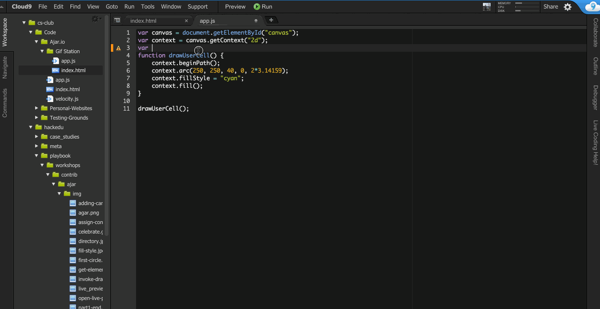

We still set the `x` and `y` to `250` because that's what we want them to be by
_default_. But now we can change them.

Let's modify our circle-drawing code to use the variables.

Inside of the `drawUserCell` function, modify the `context.arc` function like
so:

```js
context.arc(x, y, 40, 0, 2*3.14159);
```

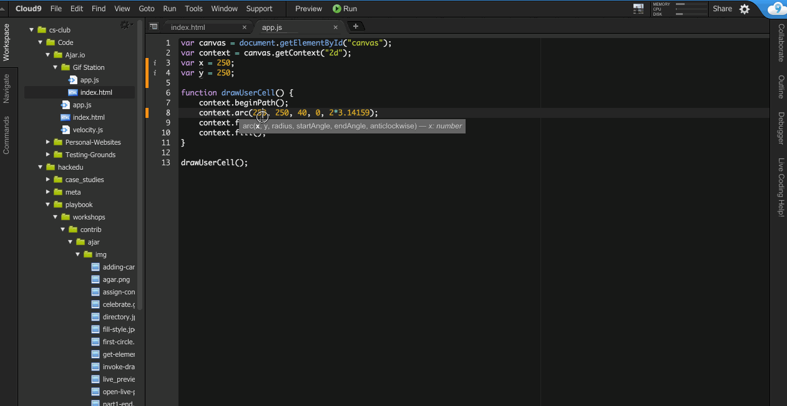

Now the circle will be drawn at the values from `x` and `y`.

Save your file and open `Live Preview`. Your results should be the same.

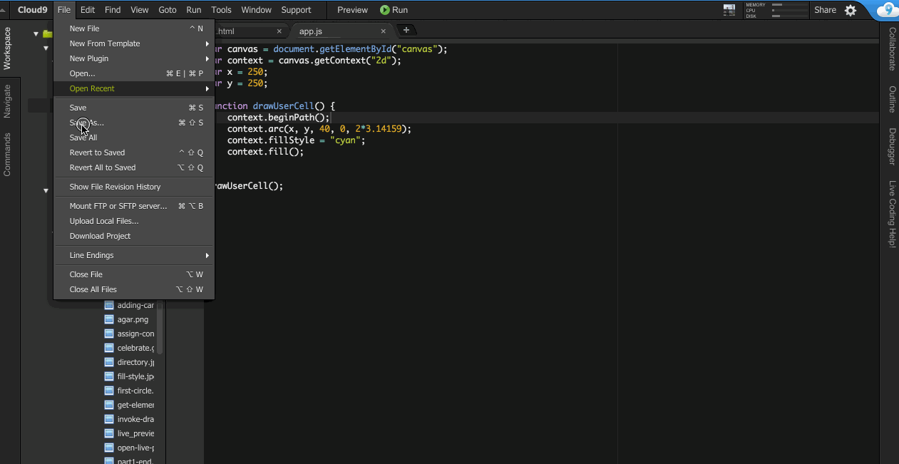

### Detect mouse movements

First we need to create a function that will be invoked each time the mouse is
moved. Here it is:

```js
function mouseMoved(mouse) {
    x = mouse.clientX;
    y = mouse.clientY;
}
```

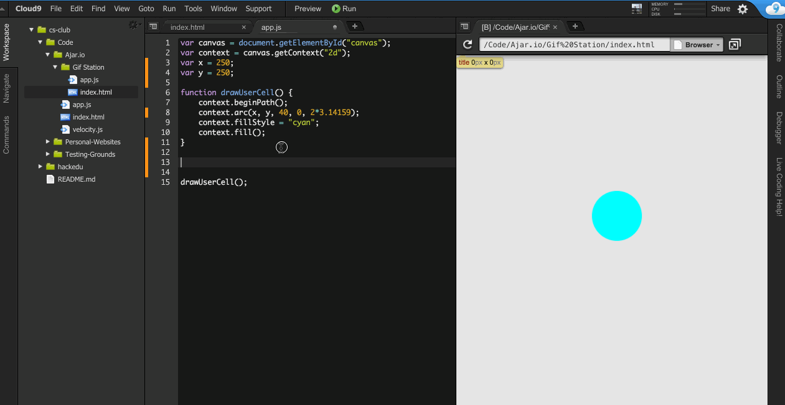

> #### Understanding the code
> - You declare a function called `mouseMoved` that takes one parameter,
>   `mouse`.
> - `mouse` is an object that contains two variables that we care about:
>   `clientX` and `clientY`. These represent, respectively, the x and y
>   coordinates of the mouse cursor in relation to the canvas.
> - You then set the varible `x` equal to the `clientX` and the variable `y`
>   equal to the `clientY`.


We detect mouse movements by adding an `EventListner` for `mousemove` to the
`<canvas>` element. The syntax looks like this:

```js
canvas.addEventListener("mousemove", /*your function goes here*/);
```

> #### Understanding the code
> This code will invoke a function that goes in place of the comment `/*your
function goes here*/` _each time the mouse is moved_.

Let's invoke the `mouseMoved` function each time the mouse is moved:

```js
canvas.addEventListener("mousemove", mouseMoved);
```

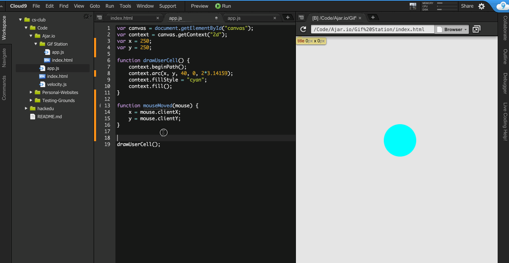

> Notice we **do not** invoke the `mouseMoved` function ourselves (by writing
`mouseMoved()`). Instead we simply tell the `EventListner` to invoke the
function for us each time it recieves a `mousemove` event.

Finally, let's draw a new cell each time the mouse is moved. To do this, we
simply invoke the `drawUserCell` function from within our `mouseMoved`
function:

```js
function mouseMoved(mouse) {
    x = mouse.clientX;
    y = mouse.clientY;
    drawUserCell(); <== NEW
}
```

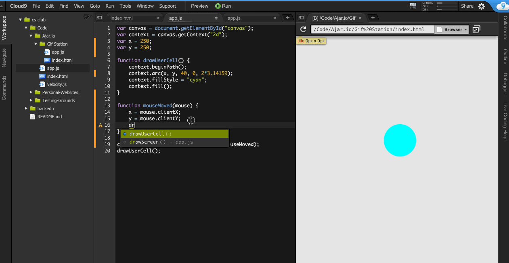

If you save now, you'll see the fruits of our labor.

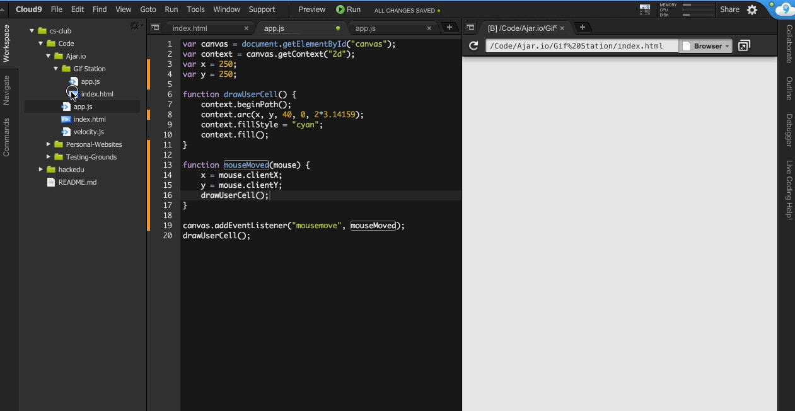

Huh. That's strange. It looks like we've just recreated Paint. Although that's
pretty cool, it wasn't what we wanted. We wanted one circle that moved with the
mouse.

Why is this happening?

If you look at the code, you'll see that each time we move the mouse we draw a
new circle at that location. We're forgetting to _clear the canvas_.

### Clearing the canvas

Clearing the canvas is pretty easy. All we've got to do is to draw a rectangle
over the whole canvas.

You could find the solution by googling "how to draw rectangle on canvas
javascript", but I'll save you the hassle.

We draw a rectangle with the `rect` function of `context`.

The `rect` function accepts 4 parameters:

> `x` - The x-coordinate of the upper-left corner of the rectangle
> `y` - The y-coordinate of the upper-left corner of the rectangle
> `width` - The width of the rectangle, in pixels
> `height` - The height of the rectangle, in pixels

Since we know the canvas is 500px by 500px, making a rectangle that covers the
whole thing looks like this:

```js
context.rect(0, 0, 500, 500);
```

Remember from part 1 that before we draw anything we have to invoke the
`beginPath` function of `context`. We'll also want to give the rectangle a
color, so we will also set the `fillStyle` to white and finally invoke the
`fill` function.

Let's put all this into a function called `clearCanvas`:

```js
function clearCanvas() {
    context.beginPath();
    context.rect(0, 0, 500, 500);
    context.fillStyle = "white";
    context.fill();
}
```

Finally invoke this function each time the mouse is moved and before you draw
the cell:

```js
function mouseMoved(mouse) {
    x = mouse.clientX;
    y = mouse.clientY;
    clearCanvas(); <== NEW
    drawUserCell();
}
```

Your `app.js` should look like this:

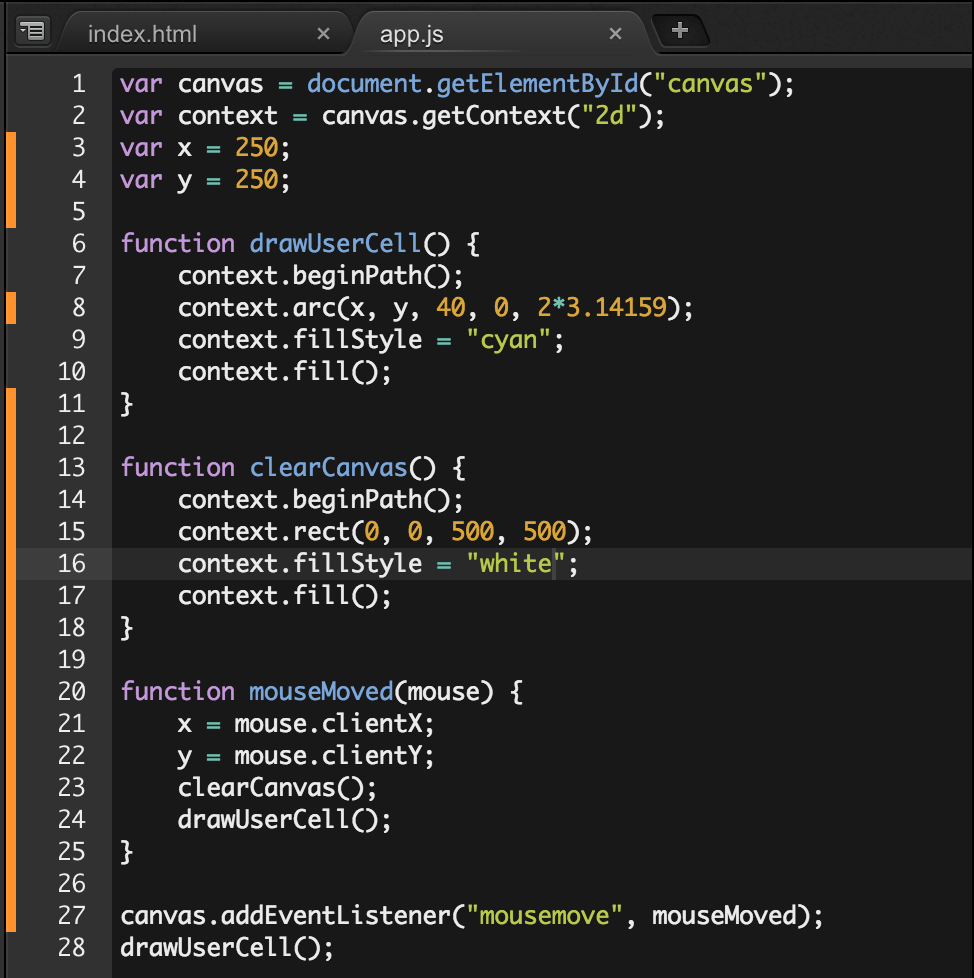

Save your work and see the results!

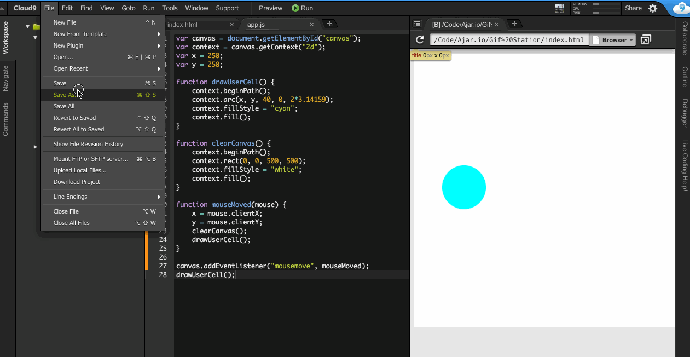

Wonderful, we have a moving cell!

#### Congrats!

You've finished Part 3!


## Part 4

In this part you will learn to give your cell's movements a velocity. That
means that the cell won't always be where your cursor is, instead it will
*follow* your cursor.

### Let's recap

In Part 3 you learned about functions. Remember that functions are
**self-contained blocks of code**. They can recieve input - In the form of
**parameters**.

This is how we wrapped the code used to draw the user's cell into a function
called `drawUserCell`:

```js
function drawUserCell() {
    context.beginPath();
    context.arc(250, 250, 40, 0, 2*3.14159);
    context.fillStyle = "cyan";
    context.fill();
}
```

And this is how we invoked the function `drawUserCell`:

```js
drawUserCell();
```

### Planning it out

What we want to do: add a velocity to the cell's movements.

How do we even approach that? It goes something like this:

1. Create an infitie loop that calculates the postition of the cell 60 times
   a second. If you're familiar with video games you might recognize 60 times
   a second as 60 frames per second or _60 fps_. More in a bit.
2. For each frame, move the cell closer to the mouse location by a given
   amount.

### Setting up the `drawScreen` function

We're now going to create a new function called `drawScreen`. This function
will be run 60 times every second __forever__.

The goal of this function is to redraw the cell closer to where the mouse is.

To redraw the cell we have to:

- Invoke the `clearCanvas` function
- Invoke the `drawUserCell` function

Addtionally we will invoke a function called `calculatePosition` before
`drawUserCell`. This function will calculate the new position of the cell after
1/60th of a second (one frame).

First though, let's set up the function named `drawScreen`:

```js
function drawScreen() {
    clearCanvas();
    drawUserCell();
    setTimeout(drawScreen, 1000/60);
}
```

> #### Understanding the code
> We create a function named `drawScreen`. This function has no parameters (the
> parentheses are empty).
>
> `setTimeout(drawScreen, 1000/60)` - This is the magic sauce. The `setTimeout`
> function is what let's our `drawScreen` function repeat 60 times a second.
> It works by taking a function - The first parameter - And running it after a
> specified delay, in milliseconds - The second parameter.
>
> It's often useful to run through your code as if you're the computer. So
> let's do that. Pretend like the `drawScreen` function just got invoked.
>
> 1. `drawScreen` function gets invoked
> 2. we clear the canvas with the `clearCanvas` function
> 3. we draw the user's cell with the `drawUserCell` function
> 4. we use the `setTimeout` function to invoke the `drawScreen` function after
>    a delay of (1000 / 60) milliseconds. Since 1000 milliseconds is equal to
>    1 second, the `drawScreen` function will be invoked in 1/60th of a second.
> 5. the `drawScreen` function gets invoked. WE'RE AT STEP 1 AGAIN! (the
>    process repeats __forever__).

Now, let's modify the `mouseMoved` function so it doesn't do what we just made
the `drawScreen` function do. Namely, let's delete these lines from the
`mouseMoved` function:

```js
clearCanvas();
drawUserCell();
```

Lastly, let's replace the invokation of `drawUserCell` at the end of the
`app.js` file with an invokation of `drawScreen`:


Now if we save the file and preview our work, we'll see exactly what we had
before. Note though that we have what we had before __even though we took a
very different approach__ to get the *same result*.

> #### Running through the code
>
> Let's quickly go through what the computer does when it executes our code:
>
> 1. Variables (`x` and `y`) and functions (`drawScreen`, `drawUserCell`,
     `clearCanvas` and `mouseMoved`) are declared.
> 2. The `mouseMoved` function is made to run each time the mouse is moved:
    ```js
    canvas.addEventListener("mousemove", mouseMoved);
    ```
> 3. The `drawScreen` function is invoked and begins it's infinite loop.
>
> At this point our program is in a stable state. The `drawScreen` function
  will continue looping. It will redraw the circle each frame at the same
  position so it won't look like anything is changing. Until...
>
> \*The mouse is moved!\*
>
> 1. The `mouseMoved` function is invoked.
> 2. The `x` and `y` are set to the coordinates of the mouse.
> 3. The next time the `drawScreen` function loops (at max in 1/60th of a
     second), it will clear the canvas (`clearCanvas`) and invoke the
     `drawUserCell` function.
> 4. The `drawUserCell` function draws another circle cenetered at `x` and `y`.
     (The `x` and `y` are now the coordinates of the mouse).
> 5. A new circle appears where the mouse is.

Great, let's now actually add velocity.

### Setting up the variables for the `calculatePosition` function

For this section it's fundamental to understand this basic concept:

*We want `x` and `y` to slowly become equal to the coordinates of the mouse,
instead of immediately as we've done so far.*

The way we do this is by increasing or decreasing `x` and `y` each frame to get
them closer to the mouse's position.

We will need to create three variables at the top of the `app.js` file:

```js
var mouseX = 250;
var mouseY = 250;
var velocity = 2;
```

The imporatant part is that `mouseX` and `mouseY` will always be equal to the
current position of the mouse. `velocity` will determine how fast the cell
moves (a higher velocity will make the cell go faster).

To make `mouseX` and `mouseY` instantaneously equal to the position of the
mouse, you must update the variables in the `mouseMoved`. So let's switch from
updating `x` and `y` to updating `mouseX` and `mouseY`:

```js
function mouseMoved(e) {
    mouseX = e.clientX;
    mouseY = e.clientY;
}
```

### The `if`-`else` statement

The `calculatePosition` will teach us a fundamental programming concept: the
__if-else__ statement.

It looks like this:

```js
if (3 > 2) {
    // code to run if condition is true
} else {
    // code to run if condition is false
}
```

The "condition" is held within the parentheses. For now we will just use basic
math operations like the `>` (greater than sign).

Since 3 *is* greater than 2, the condition is true and the code inside the `if`
statement runs.

Let's try another one:

```js
var x = 1;

if (x > 2) {
    // code to run if condition is true
} else {
    // code to run if condition is false
}
```

As you can see, the condition can contain variables too, not only numbers.

Since `x` is 1 and 1 is *not* greater than 2, the condition is false and the
code inside the `else` statement executes.

### Setting up the `calculatePosition` function

The time has finally come! Let's give our cell some velocity!

Here's the code:

```js
function calculatePosition() {
    // For the x-axis
    if (mouseX > x) {
        x = x + velocity;  // mouse is to the right of the ball
    } else {
        x = x - Velocity;  // mouse is to the left of the ball
    }

    // For the y-axis
    if (mouseY > y) {
        y = y + velocity;  // mouse is under ball
    } else {
        y = y - Velocity;  // mouse is above ball
    }
}
```

> #### Understanding the code
>
> Although this code may look intimidating, it's not hard at all — promise.
>
> `function calculatePosition()` - We declare a function called
  `calculatePosition`.
>
> `if (mouseX > x)` - The code in the `if` statement will run if the x value of
  the mouse (`mouseX`) is greater than (`>`) the x value of the circle (`x`).
  Your goal is to get `x` closer to `mouseX` so when `mouseX` is larger you must
  increase `x`. And that's exactly what you do:
  ```js
  x = x + velocity;
  ```
>
> `else` - The code in the `else` statement will run if the condition is false.
  in this case the condition is false if `mouseX` is less than (`<`) `x`. When
  `mouseX` is less than `x` we must reduce `x` to get it closer to `mouseX`.
  And that's exactly what you do:
  ```js
  x = x - Velocity;
  ```
>
> The same explanations apply to the y-axis code.
>
> *__Note__: it is not entirely accurate that the opposite of `mouseX > x` is
  `mouseX < x`. In fact the wiggling you'll see in a minute is partly due to
  this approximation. Use this hint for Challenge #1.*

### Invoking the `calculatePosition` function

Remember what the purpose of writing the `calculatePosition` function was? It
was so that we can calculate the position of the cell *once every frame*.

Where can we do things once per frame (every 1/60th of a second)? Oh right! In
the `drawScreen` function.

So let's invoke `calculatePosition` in the `drawScreen` function. Note that it
has to be __before__ you invoke the `drawUserCell` function because
`drawUserCell` will use the position calculated by the `calculatePosition`
function:

```js
function drawScreen() {
    clearCanvas();
    calculatePosition();  <-- NEW
    drawUserCell();
    setTimeout(drawScreen, 1000/60);
}
```

Your `app.js` should look like this:


Save your work and preview your results!

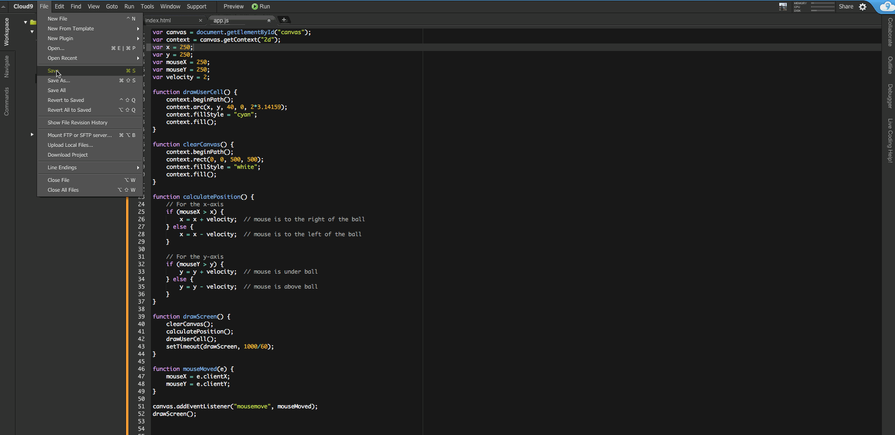

Our cell has velocity!

## Part 5

In this lesson you will add food at hardcoded positions. You will also learn
about javascript arrays.

This is how it's going to work:

1. Create an array to hold the positions of the food
2. Modify the `drawUserCell` function to work for any circle (i.e. food and the
   user cell).
3. Draw the food at the positions held in the array during the `drawScreen`
   function.

### What are arrays?

The Array object is used to store multiple values in a single variable.

You can store strings:

```js
var cars = ["Saab", "Volvo", "BMW"];
```

numbers:

```js
var lotteryWinners = [23, 6, 25, 9, 15];
```

or anything else.

Array indexes are zero-based: The first element in the array is 0, the second is
1, and so on.

To access the 2nd element of the `cars` array we can do this:

```js
var secondElement = cars[1]; <-- THE VALUE WILL BE "volvo"
```

### Store food positions in an array

Let's create an array named `foodPositions` at the top of the `app.js` file.
This array will contain an array of an (x, y) coordinate pair for each food
position. Yep, that's right. *An array can contain other arrays*.

This is what a coordinate pair array will look like:

```js
[30, 100]
```

This pair represents the location (30, 100) where x is `30` and y is `100`.

Here's the array we're going to make:

```js
[[30, 20], [400, 90], [60, 317], [300, 268]]
```

We want to store this array in a variable named `foodPositions`:

```js
var foodPositions = [[30, 20], [400, 90], [60, 317], [300, 268]];
```

### Generalizing (abstracting) the `drawUserCell`

We now want to "generalize" (more accurately *abastract*) the `drawScreen`
function to draw any type of circle, not just the user's cell.

Let's remeber how we draw a circle ([here's a link to when we did this
earlier](#drawingArc)):

```js
context.arc(x, y, radius, startAngle, endAngle);
```

Since all circles will have the same `startAngle` and `endAngle`, the only
parameters we will need to change are `x`, `y` and `radius`.

We'll first start off by changing the name of the `drawUserCell` function to
`drawCircle`:

```js
function drawCircle () {
    ...
}
```

Next we'll add some parameters:

```js
function drawCircle(circleX, circleY, radius) {
    context.beginPath();
    context.arc(circleX, circleY, radius, 0, 2*3.14159);
    context.fillStyle = "cyan";
    context.fill();
}
```

Finally change the invokation of the old `drawUserCell` inside of `drawScreen`
to invoke `drawCircle` instead:

```js
drawCircle(x, y, 40);
```

Lastly, below that invokation (which draws the user cell), we are going to
draw the food:

```js
drawCircle(foodPositions[0][0], foodPositions[0][1], 10);
drawCircle(foodPositions[1][0], foodPositions[1][1], 10);
drawCircle(foodPositions[2][0], foodPositions[2][1], 10);
drawCircle(foodPositions[3][0], foodPositions[3][1], 10);
```

Preview your work! We have food!

Your code should look like this:

```js
var canvas = document.getElementById("canvas");
var context = canvas.getContext("2d");
var x = 250;
var y = 250;
var mouseX = 250;
var mouseY = 250;
var velocity = 2;
var foodPositions = [[30, 20], [400, 90], [60, 317], [300, 268]];

function drawCircle(cellX, cellY, radius) {
    context.beginPath();
    context.arc(cellX, cellY, radius, 0, 2*3.14159);
    context.fillStyle = "cyan";
    context.fill();
}

function clearCanvas() {
    context.beginPath();
    context.rect(0, 0, 500, 500);
    context.fillStyle = "white";
    context.fill();
}

function calculatePosition() {
    // For the x-axis
    if (mouseX > x) {
        x = x + velocity;  // mouse is to the right of the ball
    } else {
        x = x - Velocity;  // mouse is to the left of the ball
    }

    // For the y-axis
    if (mouseY > y) {
        y = y + velocity;  // mouse is under ball
    } else {
        y = y - Velocity;  // mouse is above ball
    }
}

function drawScreen() {
    clearCanvas();
    calculatePosition();
    drawCircle(x, y, 40);
    drawCircle(foodPositions[0][0], foodPositions[0][1], 10);
    drawCircle(foodPositions[1][0], foodPositions[1][1], 10);
    drawCircle(foodPositions[2][0], foodPositions[2][1], 10);
    drawCircle(foodPositions[3][0], foodPositions[3][1], 10);
    setTimeout(drawScreen, 1000/60);
}

function mouseMoved(e) {
    mouseX = e.clientX;
    mouseY = e.clientY;
}

canvas.addEventListener("mousemove", mouseMoved);
drawScreen();
```

#### Congrats!

You've finished Part 5!


One last thing. Please click a rating below to rate this workshop. It'll only
take 3 seconds.

_How likely is it that you would recommend this workshop to a friend?_

| [1][r1] | [2][r2] | [3][r3] | [4][r4] | [5][r5] | [6][r6] | [7][r7] | [8][r8] | [9][r9] | [10][r10] |
| ------- | ------- | ------- | ------- | ------- | ------- | ------- | ------- | ------- | --------- |

[r1]: https://feedback-redir.hackclub.io/1G3uGC0z34i_hObK6MzBF8YKh9oVFgYf7fzfNL2VvGOQ?ip=entry.78173348&rfield=entry.559841237&r=1
[r2]: https://feedback-redir.hackclub.io/1G3uGC0z34i_hObK6MzBF8YKh9oVFgYf7fzfNL2VvGOQ?ip=entry.78173348&rfield=entry.559841237&r=2
[r3]: https://feedback-redir.hackclub.io/1G3uGC0z34i_hObK6MzBF8YKh9oVFgYf7fzfNL2VvGOQ?ip=entry.78173348&rfield=entry.559841237&r=3
[r4]: https://feedback-redir.hackclub.io/1G3uGC0z34i_hObK6MzBF8YKh9oVFgYf7fzfNL2VvGOQ?ip=entry.78173348&rfield=entry.559841237&r=4
[r5]: https://feedback-redir.hackclub.io/1G3uGC0z34i_hObK6MzBF8YKh9oVFgYf7fzfNL2VvGOQ?ip=entry.78173348&rfield=entry.559841237&r=5
[r6]: https://feedback-redir.hackclub.io/1G3uGC0z34i_hObK6MzBF8YKh9oVFgYf7fzfNL2VvGOQ?ip=entry.78173348&rfield=entry.559841237&r=6
[r7]: https://feedback-redir.hackclub.io/1G3uGC0z34i_hObK6MzBF8YKh9oVFgYf7fzfNL2VvGOQ?ip=entry.78173348&rfield=entry.559841237&r=7
[r8]: https://feedback-redir.hackclub.io/1G3uGC0z34i_hObK6MzBF8YKh9oVFgYf7fzfNL2VvGOQ?ip=entry.78173348&rfield=entry.559841237&r=8
[r9]: https://feedback-redir.hackclub.io/1G3uGC0z34i_hObK6MzBF8YKh9oVFgYf7fzfNL2VvGOQ?ip=entry.78173348&rfield=entry.559841237&r=9
[r10]: https://feedback-redir.hackclub.io/1G3uGC0z34i_hObK6MzBF8YKh9oVFgYf7fzfNL2VvGOQ?ip=entry.78173348&rfield=entry.559841237&r=10

# More coming soon...
