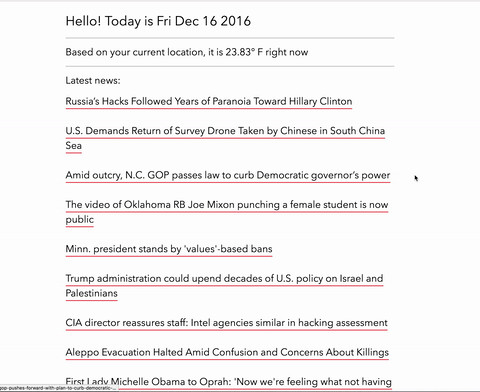
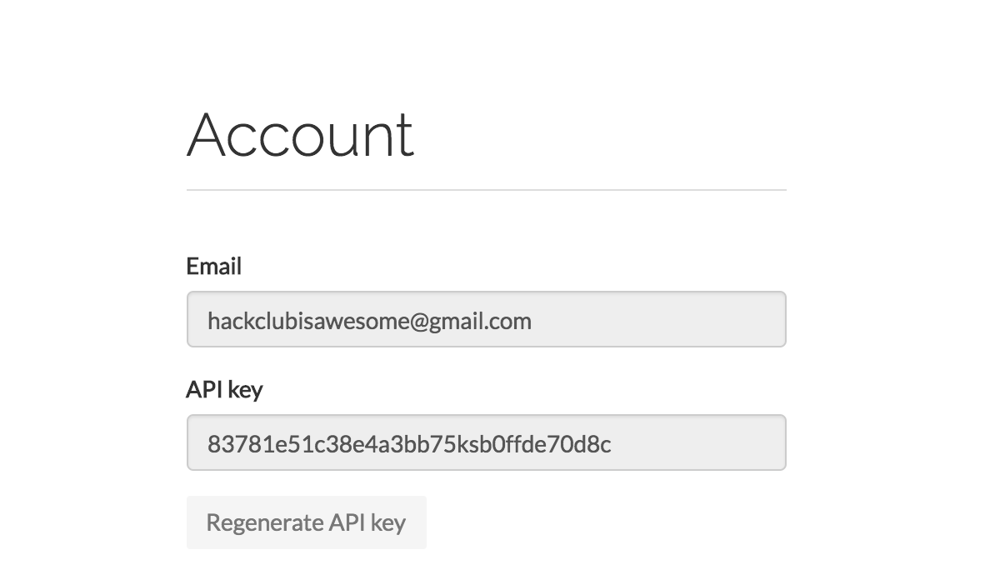

# Dashboard

What you'll be building:



Links to a live demo and the final code below. This workshop should take around an hour.

[**Live Demo**](https://dashboard--prophetorpheus.repl.co)

[**Final Code**](https://https://repl.it/@prophetorpheus/dashboard)

Have you heard of an API? Basically, an API, or an application program interface, is a set of protocols or routines that can help you build a software project. Often, APIs are available to use through companies that allow anyone access to their services. For example, one can make an app to search tweets with a [Twitter API](https://dev.twitter.com/docs), or one could even use the [Spotify API](https://developer.spotify.com/showcase/) to grab the latest music data. 

In this project, we'll be building a personal dashboard with a couple widgets that will display:

- The date
- The weather based on the user's current location
- The latest news

We'll be using the [Dark Sky API](https://darksky.net/dev/) for the weather, and the [News API](https://newsapi.org/) to fetch the latest news. 

**Table of Contents**

- [Part I: Registering for the APIs](#part-i-registering-for-the-APIs)
- [Part II: The markup](#part-ii-the-markup)
- [Part III: The functions](#part-iii-the-functions)
- [Part IV: Some styling](#part-iv-some-styling)
- [Part V: Publishing and Sharing](#part-v-publishing-sharing-and-improving)

## Part I: Registering for the APIs

Before we begin, you'll have to sign up for a [Dark Sky API key](https://darksky.net/dev/). Go ahead and visit the site and sign up. Once you're logged in, you'll reach a page that looks like this: 


Take note of your API key (it'll be different for you). 

Next, go ahead and sign up for an [News API key](https://newsapi.org/). Once you sign up, you'll get to a page like this: 



Once again, keep your API key handy to use in our JavaScript functions. 

## Part II: The markup

We'll be keeping our markup really simple. Along with our basic tags, we'll be importing the normalize CSS library and our `index.css` stylesheet, adding three `id`s for our date, weather, and news. Lastly, we'll need to link up jQuery and the `index.js` file where we will write our functions. 

```html
<!DOCTYPE html>
<html>
  <head>
    <title>My Dashboard</title>

    <meta name="viewport" content="width=device-width, initial-scale=1">
    <meta charset="utf-8">

    <link rel="stylesheet" href="https://cdnjs.cloudflare.com/ajax/libs/normalize/5.0.0/normalize.min.css">
    <link rel="stylesheet" href="index.css">
  </head>

  <body>

    <h1>Hello! Today is <span id="date"></span></h1>
    <hr>

    <h2><span id="weather"></span></h2>
    <hr>

    <h2>Latest news:</h2>
    <div id="news">
    </div>
    <p>Powered by <a href="https://newsapi.org/">NewsAPI</a> and <a href="https://darksky.net/poweredby/">Dark Sky</a></p>

    <script
        src="https://code.jquery.com/jquery-3.1.1.min.js"
        integrity="sha256-hVVnYaiADRTO2PzUGmuLJr8BLUSjGIZsDYGmIJLv2b8="
        crossorigin="anonymous"></script>
    <script type="text/javascript" src="index.js"></script>
  </body>
</html>
```

Take a look at the [Personal Website](https://hackclub.com/workshops/personal_website/) workshop to learn more about basic HTML markup, if you haven't already.

## Part III: The functions

Our JavaScript is where we will actually build our app. Open the file up and and create a function. This function will grab the date, and then use something called function chaining to split the date string and splice it to print only the first four words of the string. If we didn't do this, JavaScript would print out the time too. 

```js
function loadDate() {
  var currentDate = new Date(); 
  var dateString = currentDate.toString()
                     .split(" ") 
                     .splice(0, 4) // making the string contain only the first four words
                     .join(" "); 

  $("#date").text(dateString);
}
```

Hack Club has published several workshops in JavaScript and jQuery. The [That Was Easy](../that_was_easy/) workshop uses simple jQuery to communicate with a button element. To learn some basics of JavaScript functions and variables, take a look at the [Geometric Pattern](../geometric_pattern/) or [Dodge](../dodge/) workshop. 

Moving on, we come to the weather function. Let's start by creating a function and assigning variables to our `weather id`, `url`, and `apiKey`. 

```js
function loadWeather() {
  var weather = $("#weather");
  var url = "https://api.forecast.io/forecast/"; // Dark Sky API url
  var apiKey = "YOUR API KEY"; // API key from Dark Sky
}
```

Now that we've got those variables, we can use HTML5's geolocation API to obtain the latitude and longitude of the user. Then, we'll need to make a API request to the Dark Sky URL. With that JSON data, we can then parse it to display the current temperature of the location with those coordinates. This is how it will work: 

```js

  function success(position) {
    var latitude = position.coords.latitude; // latitude using geolocation
    var longitude = position.coords.longitude; // longitude using geolocation

    // API request:
    $.getJSON(url + apiKey + "/" + latitude + "," + longitude + "?callback=?", function(data) {
      weather.text("Based on your current location, it is " + data.currently.temperature + "° F right now");
    });
  }

  // This message is displayed if their is a geolocation error:
  function error() {
    alert("Unable to retrieve your location for weather");
  }

  // calling the geolocation API
  navigator.geolocation.getCurrentPosition(success, error);

  // the text that will be displayed while the function is making the request
  weather.text("fetching weather...");
}
```

_Note: If you would prefer to use Celsius, change `?callback=?` in the above code to `?units=si&callback=?`*, and the `F` to a `C` on the line below._

Here's what the `loadWeather()` function should look like: 

```js
function loadWeather() {
  var weather = $("#weather");
  var url = "https://api.forecast.io/forecast/"; // Dark Sky API url
  var apiKey = "YOUR API KEY"; // API key from Dark Sky

  function success(position) {
    var latitude = position.coords.latitude; // latitude using geolocation
    var longitude = position.coords.longitude; // longitude using geolocation

    // API request:
    $.getJSON(url + apiKey + "/" + latitude + "," + longitude + "?callback=?", function(data) {
      weather.text("Based on your current location, it is " + data.currently.temperature + "° F right now");
    });
  }

  // This message is displayed if their is a geolocation error:
  function error() {
    alert("Unable to retrieve your location for weather");
  }

  // calling the geolocation API
  navigator.geolocation.getCurrentPosition(success, error);

  // the text that will be displayed while the function is making the request
  weather.text("fetching weather...");
}
```

At last, we come to our news function. Let's set the variables up similarly to how we did with the `loadWeather()` function. 

```js
function loadNews() {
  var news = $("#news");
  var url = "https://newsapi.org/v1/articles?source=google-news&sortBy=top&apiKey="; // News API url
  var apiKey = "YOUR API KEY"; // API key from News API
}
```

The API request will be very similar to the `loadWeather()` request, but this time, we have to get multiple sets of data:

- The title of the articles
- The URL of those articles

That's why we'll need to use a `map()` method to call every element in the data set. In this case, we'll need the URL of the articles and the titles. 

```js

  $.getJSON(url + apiKey, function(data) {

    // map() method to call article urls and titles

    var titles = data.articles.map(function(articles) {
      return "<a href='" + articles.url + "'>" + articles.title + "</a>";
    });

     // joining the titles with two line breaks

    news.html(titles.join("<br><br>"));
  });

  // the text that will be displayed while the function is making the request
  news.text("fetching news..."); 
}
```

This is what your `loadNews()` function should look like: 

```js
function loadNews() {
  var news = $("#news");
  var url = "https://newsapi.org/v1/articles?source=google-news&sortBy=top&apiKey="; // News API url
  var apiKey = "YOUR API KEY"; // API key from News API

  $.getJSON(url + apiKey, function(data) {

    // map() method to call article urls and titles

    var titles = data.articles.map(function(articles) {
      return "<a href='" + articles.url + "'>" + articles.title + "</a>";
    });

     // joining the titles with two line breaks

    news.html(titles.join("<br><br>"));
  });

  // the text that will be displayed while the function is making the request
  news.text("fetching news..."); 
}
```

Lastly, before we close out of our `index.js` file, make sure to call all your functions! 

```js
loadDate();
loadWeather();
loadNews();
```

## Part IV: Some styling

We still have one last step: we need to make our dashboard look decent! Open up your `index.css` and let's get to work!

First off, let's center the whole HTML app using `margin: 0 auto;` and `max-width`. We'll also change up our `font-family`. 

```css
html {
  max-width: 50em;
  margin: 0 auto;
  padding: 10px;
  font-family: Avenir Next, Helvetica, sans-serif;
}
```

Then, we can adjust the `a tags` (or links) to have a border underneath them and making them italicize on hover like this: 

```css
a {
  text-decoration: none;
  color: #000;
  border-bottom: 2px solid #e42d40;
}

a:hover {
  font-style: italic;
}
```

Lastly, we can adjust elements such as `font-weight`, `font-size`, and `line-height`.

```css
h1, h2, #news {
  font-weight: 300;
}

#news {
  font-size: 1.5em;
  line-height: 1.5em;
}
```

Feel free to change up the styles to your liking!

## Part V: Publishing, sharing, and improving

To conclude this project, be sure to press **Run** so that the URL gives the most recent website. Now you're excellent to share your dashboard at `https://REPL_NAME--USERNAME.repl.co`

Then, make sure to share your project using the `#shipit` channel on Slack!

Of course, this project is just a starting point. Try to add even more of your own widgets using the vast world of APIs!
