<!-- markdown-toc start - Don't edit this section. Run M-x markdown-toc-generate-toc again -->
**Table of Contents**

- [Basic Git and GitHub](#basic-git-and-github)
  - [Tips And Tricks](#tips-and-tricks)
  - [Preparing Your Workspace](#preparing-your-workspace)
  - [What is Git?](#what-is-git)
  - [Git's Tools](#gits-tools)
    - [Repository](#repository)
    - [Branch](#branch)
    - [Master Branch](#master-branch)
  - [What is GitHub?](#what-is-github)
  - [Git and GH-Pages w/ provided link](#git-and-gh-pages-w-provided-link)
    - [Preparations](#preparations)
    - [Using Git and GitHub](#using-git-and-github)
  - [Git and GH-Pages w/o provided link](#git-and-gh-pages-wo-provided-link)
  - [More Commands](#more-commands)
    - [Clone](#clone)
    - [Merge](#merge)
  - [Extended GitHub Knowledge](#extended-github-knowledge)
    - [Pull Requests](#pull-requests)
    - [GitHub Terminology](#github-terminology)
      - [Fork](#fork)
      - [Pull Request](#pull-request)
      - [Issue](#issue)
      - [Contributor](#contributor)
  - [Follow us on GitHub!](#follow-us-on-github)
  - [Explore!](#explore)

<!-- markdown-toc end -->

# Basic Git and GitHub

## Tips And Tricks

1. To see a GIF in another tab, right click on the GIF and click _open in new
   tab_.
2. **Don't include** the **square brackets** mentioned (`[text-here]`) when
   typing.
   - Those are indicators of areas where you type custom text.
   - `5. Type: git branch [branch-name]` would be: `git branch custom-text`.
3. After you type a command in the terminal, hit **"enter"** on your
   **keyboard** to complete the command.

## Preparing Your Workspace

_Note: If you already have a pre-existing workspace you can skip to the
[next section](#what-is-git)._

Git requires at least **one** file in your workspace to be used. The steps below
will take you through setting the workspace up.

1. Login to your Cloud9 homepage - https://c9.io/
   - Register if you haven't already.
     - We recommend signing up with your GitHub account - https://github.com/.
   - It should look like this: 

     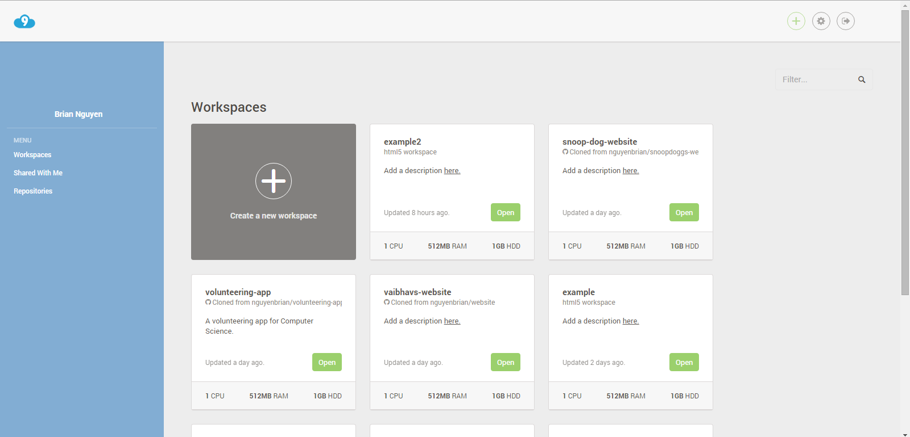

2. Create a workspace! 
   - Press the **create a new workspace** button.

     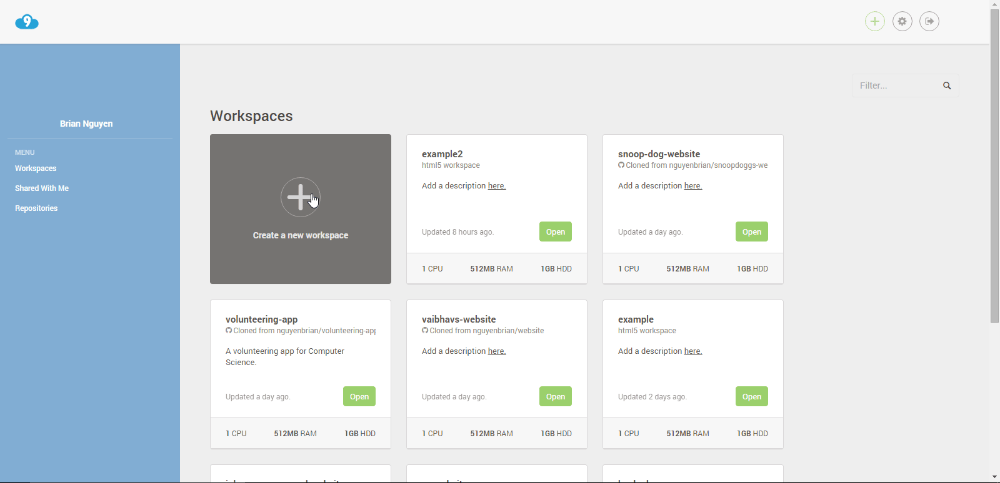

   - Give the workspace a good name that conveys what the workspace is used for
     quickly, and concisely.
     - There are no spaces allowed in the name, use a dash (`-`) for spaces if
       you need them.
   - Add a short description, you'll thank yourself later!
   - Select public for the privacy settings, it'll make it easier for people to
     help you with your project.
   - If you already have a GitHub project with files and you want to have it
     ready when you create the workspace you can add its link in the box
     provided.
   - For the template you may choose either **Custom** or **HTML5**.

     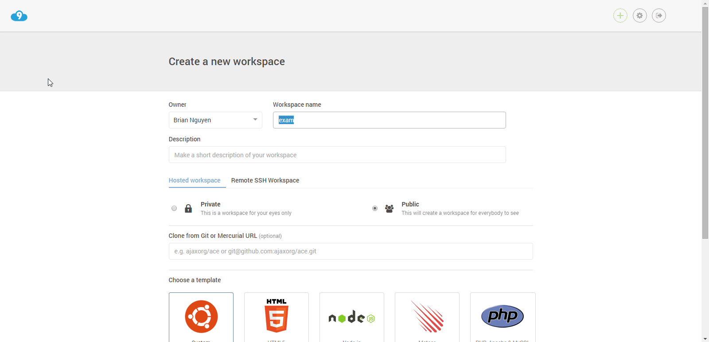

3. Get rid of the unnecessary junk.
   - On the left sidebar: Right click on README.md and hello-world.html.
     - Select **"Delete"** and **Yes** to any warnings.
       - You won't need these for your project.
   - Close the opened README.md as well.

     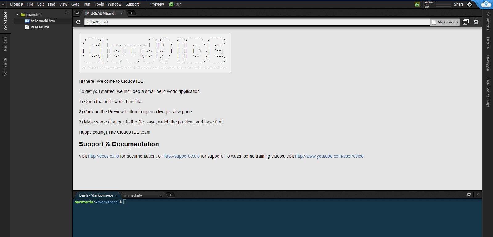

4. Create an index.html file.
   - On the left sidebar: Right click and press **"New File"**.
   - Name the file **index.html**.
   - Double-click and open it.
5. Write your name in the index.html file.
   - If you don't know how, you may use this pre-provided code:

   ```html
   <!DOCTYPE html>
   <html>
       <head></head>
       <body>
           <p>Your name here</p>
       </body>
   </html>
   ```

6. Save the index.html file.
   - Make sure the active file is the index.html file by either clicking on it
     on the sidebar or clicking anywhere in the code.
   - You may press Ctrl+S (Windows), Command+S (Mac) or go to File --> Save.

     

7. Celebrate!

   Your workspace is now ready to be used with Git!

## What is Git?

**Git is a version control system** - https://git-scm.com/
  - Tracks and manages changes to your code.

    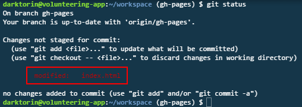

  - Git has tools to show that it has **detected** a **change** in the **file**.
    - Changes consist of anything you've added or removed from the file.
  - Git allows you to save the same files at different points in time.
    - This allows us to look at our code's history from start to finish.
      - If we make a mistake and it seems irreversible, just select a version of
        the file from back in time.

**Example: If We Used Git With Word Documents**
- You are using Word and have a file named mystory.docx.
  - You write for 5 hours and save each hour.
    - Each time you save, this overwrites your copy.
- With Git, it would instead create another version of the file in that point of
  time.
  - Git hides these other versions so your folder doesn't get messy, but you can
    call on the others if need be.

- Git treats every version of code as a **"snapshot"** that you can look **back/
  revert** to at anytime.
  - Running a command called `git log` in the terminal displays every change
    you've saved:

    

## Git's Tools

### Repository

_(short-form: "repo")_

A repository is a place where your project files are stored.

- Sort of like a main **folder**

### Branch

- It's like a folder inside of your **repo**.
  - Where your files are stored.
- You use branches for teams collaboration.
  - Two people don't work on the same file at the same time.
    - Each person has their own version of the code.
- Their own copy of the files is called a **fork** or **"forking a repo"**.
- Must be named without spaces -- **replace a space with a dash (-)**.


**Example: Why Branches?**

_Bob & John are working on one repo and the same files at the same time:_

- Bob encounters a bug, it will take about an hour to fix.
- John wants to continue working, but Bob's bug is not allowing him to continue.
  - In this situation, John would have to wait for Bob to fix the bug, then
    continue his own work.
- An better alternative: Create two different versions of the same folder and
  its files of code (different branches).
  - Work on their own work and bring them together when they are done.

**Example: Branch Merging**

- Bob is working on the main.css file for the tool bar.
- John is also working on the main.css file, but for the header.
- We don't want them overlapping each other's code!
  - Make changes to their own **branches** and then **merge** after to bring
    both of their changes together.
  - Git has tools that allows you merge changes even if they occupy the same
    file and lines.

### Master Branch

- The main **branch**
  - Git creates this **branch** automatically for you.
    - This is only for completed versions of the code.
- Where coders (you!) **merge** their final changes.
  - Bob and John would merge their changes in the **master branch**.

**Diagram of Master branch versus Another Branch**

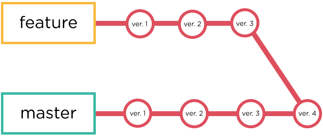

- Think of "master" as the tree trunk and "feature" as a literal branch.

## What is GitHub?

GitHub (https://github.com/) is an online **Git repository hosting service**.

- A friendly way to look at and manage **repositories** and **branches with** a
  GUI (graphical user interface).
  - Basically prettier than just text on the terminal.
- Has its own tools that makes it easier and faster to collaborate with others
  (we'll go into that later!).

## Git and GH-Pages w/ provided link

**GitHub Pages is a free service by GitHub** that allows you to host a website
on their servers (https://pages.github.com/).

- The URL will have to be [username].github.io/[reponame]

### Preparations

1. You **need** to have at least one **file named "index.html"**.
   - This is the conventional name of the main HTML file and GitHub Pages
     **won't host your files without one**
2. You **provided** a **Git link** when you **made the workspace**:

   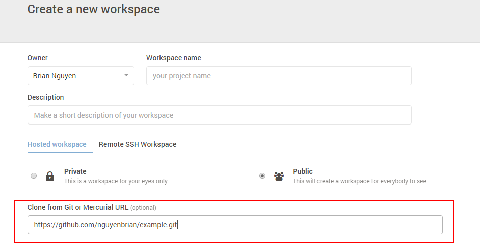

   Nah, not familiar? Follow the steps in
   **[Git and GH-Pages w/ provided link](#git-and-gh-pages-w-provided-link) in
   heading below**

### Using Git and GitHub

1. Open your terminal

   - Depending on the workspace configuration you set, it might already be
     opened.
   - Hit the "+" button in the bottom panel area OR on the top-bar click
     "Window" and "New Terminal".

     

2. Type the command: `git add [file]` OR `git add .`.
   - Adds a file to be tracked by git.
     - E.g. `git add index.html`.
   - My only file is "index.html".
     - In the case you have **more than one file**, the **period [.] means add
       every file** in the workspace to the tracked files.
       - E.g. `git add .`

     

3. Type: `git commit -m "[commit message here]"`.
   - Commits changes to be pushed to the branch.
     - `-m` stands for message and in quotations put a message that descriptions
       what you did.
       - If it is the first commit, simply put `git commit -m "first commit"`.
   - Think of committing as packaging something into a package and putting the
     shipping label on it.
   - Don't make bad commit messages: be concise, but clear about what you did.
     - [Bad message example](img/bad_commit_message.png)
     - [Good message example](img/good_commit_message.png)

     

4. Type: `git push`.
   - Part two of saving, **"pushing"**.
     - Uploading to GitHub.
   - Think of pushing as actually shipping the container to the recipient, which
     in this case is the repo.
   - After hitting enter, you need to sign with your **GitHub credentials**.
     - You can you find your username either on your profile or at these spots
       when you login to GitHub.

    

  - The characters for the password not show up in the terminal for security
    reasons -- just keep typing!

    

5. Type: `git branch [branch-name]`.
   - Creates a branch.
   - We must name this [branch name] **gh-pages**.
     - GitHub will only host files in a branch named gh-pages.
   - **Example command: git branch gh-pages**.
   - Must be named without spaces -- **replace a space with a dash (-)**.
   - If you create a branch with the wrong name, delete it using:.
     - `git branch -d [name of branch]`.
6. Type: `git push gh-pages`.
   - Push your branch, **gh-pages**, online to GitHub.
   - Afterwards your website should be up at [yourusername].github.io/[reponame].
   - It might take about 30 seconds to fully get online.

     

7. Go online to [username].github.io/[reponame].
   - Your website is now online! Enter the URL using your credentials and it
     should show up (wait 30 seconds or more if it doesn't).
     - E.g. nguyenbrian.github.io/example2.
   - Note: The repo name is different from the branch name.
     - **The URL has is case sensitive - ensure the repo name is exactly the
       same one you put into your URL.**
   - **Example: jevinsidhu.github.io/Personal-Website**
8. Celebrate!

   Congrats, now you're a Git (6) God!

   

## Git and GH-Pages w/o provided link

1. Open your terminal.
   - Depending on the workspace configuration you set, it might already be
     opened!
   - Hit the "+" button in the bottom panel area OR on the top-bar click
     "Window" (8th from the right) and "New Terminal".

     

2. In the terminal, type: `git init`.
   - This creates a .git file inside of your project folder.
   - The .git file stores all the location data for your workspace.
   - This allows you to use git inside your folder.

   

2. Type: `git remote add [remote-name] [link to repo]`.
   - Your changes need to connect your local folder to a remote one on GitHub.
     - You need a connection between the two --> Create a remote.
   - On GitHub, **click the green button that says "New Repository" near the
     middle-right area**.
     - Name your repo (e.g hello-world) and give a short description.
       - No spaces between your name --> replace a space with a dash (-).
       - Short and to the point description.
   - Click the green button that says "Create repository".
   - Copy the .git link it provides -- that's your `link to repo`.
   - It will be something similar looking to:
     https://github.com/nguyenbrian/example.git

     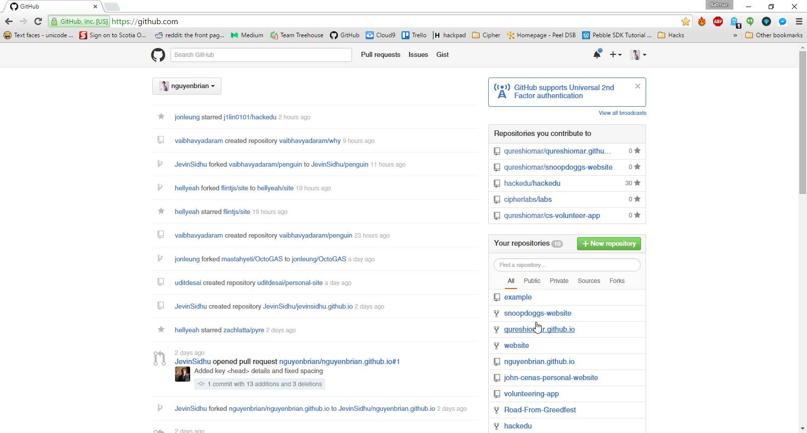

   - **Example: Remote is a TV Remote Controller**.
     - Hand is your local copy.
     - **TV** is the **remote repo on GitHub**.
     - The **remote** is the **controller**.

     If you want to change the channel, you hit one channel up on the
     **controller (remote)** with your **hand (local)** and it **changes** the
     channel one upon your **TV (remote repo)**.

   - Open your terminal on **Cloud 9** and type the command:
     - `git remote add [remote-name] [link to repo]`
   - [remote-name] is where you name your remote.
     - **Don't include the square brackets** when you type, this is custom text
       you are inserting.
     - Name it something clear.
       - i.e. github
     - **[link to repo]** is where you paste the link from earlier.
       - Again, don't include the square brackets.
     - **Example command**: `git remote add github
       https://github.com/nguyenbrian/example.git`.

     

3. Type: `git add [filename.extension]` OR `git add .`.
   - Adds a file to be tracked by git.
     - E.g. `git add index.html`.
   - My only file is "index.html".
     - In the case you have **more than one**, the **period [.] means add every
       file** in the workspace to the tracked files.
       - E.g. `git add .`.

     

3. Type: `git commit -m "[commit message here]"`.
   - Commits changes to be pushed to the branch.
     - `-m` stands for message and in quotations put a message that descriptions
       what you did.
       - If it is the first commit, simply put `git commit -m "first commit"`.
   - Think of committing as packaging something into a package and putting the
     shipping label on it.
   - Don't make bad commit messages: be concise, but clear about what you did.
     - [Bad message example](img/bad_commit_message.png)
     - [Good message example](img/good_commit_message.png)

     

4. Type: `git push`.
   - Part two of saving, **"pushing"**.
     - Uploading to GitHub.
   - Think of pushing as actually shipping the container to the recipient, which
     in this case is the repo.
- After hitting enter, you need to sign with your **GitHub credentials**.
  - You can you find your username either on your profile or at these spots when
    you login to GitHub.

    

  - The characters for the password not show up in the terminal for security
    reasons -- just keep typing!

    

5. Type: `git branch [branch-name]`.
   - Creates a branch.
   - We must name this [branch name] **gh-pages**.
     - GitHub will only host files in a branch named gh-pages.
   - **Example command: git branch gh-pages**.
   - Must be named without spaces -- **replace a space with a dash (-)**.
   - If you create a branch with the wrong name, delete it using:.
     - `git branch -d [name of branch]`
6. Type: `git push gh-pages`.
   - Push your branch, **gh-pages**, online to GitHub.
   - Afterwards your website should be up at [yourusername].github.io/[reponame].
   - It might take about 30 seconds to fully get online.

     

7. Go online to [username].github.io/[reponame].
   - Your website is now online! Enter the URL using your credentials and it
     should show up (wait 30 seconds or more if it doesn't).
     - E.g. nguyenbrian.github.io/example2
   - Note: The repo name is different from the branch name.
     - **The URL has is case sensitive -- ensure the repo name is exactly the
       same one you put into your URL**.
   - **Example: jevinsidhu.github.io/Personal-Website**.
8. Celebrate!

   You successfully pushed your site online!

   

## More Commands

### Clone

`git clone [repo-url]`

Cloning a workable copy of a repo onto your local workspace is when you download
the repo onto a new computer.


You'll find the **[repo-url]** when you click a into a repo on GitHub and look
for this:


### Merge

`git merge [branch-to-merge-changes-from]`

Merging combines the differences from another branch into the current branch
you're working in. For the time being, stay away from this and do a
[pull request](#pull-requests) using GitHub.

## Extended GitHub Knowledge

### Pull Requests

A pull request means to request changes to be "pulled" from one branch into
another. Pull requests are commonly used to merge feature branches into master
branches.

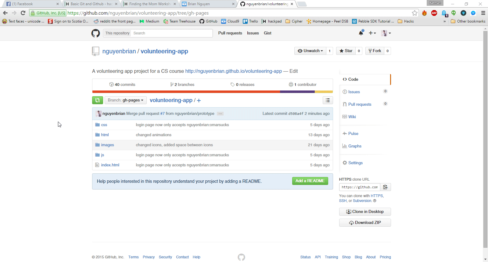

A good Git workflow:


### GitHub Terminology

#### Fork

- Creates an identical repo under your name allowing you to edit its contents.

Similar to a clone, except instead of merging you would do a pull request to
merge your changes to the master repo.

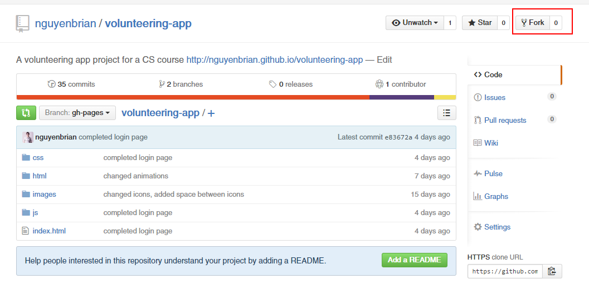

#### Pull Request

- Request to merge the contents of a branch or fork into a repo.
- Needs to be approved by the administrators of the repo you're trying to merge
  into.
- Pulls the data from your repo into the main repo.

#### Issue

- User-submitted bug tracker.
- Allows contributors to discuss the bugs.

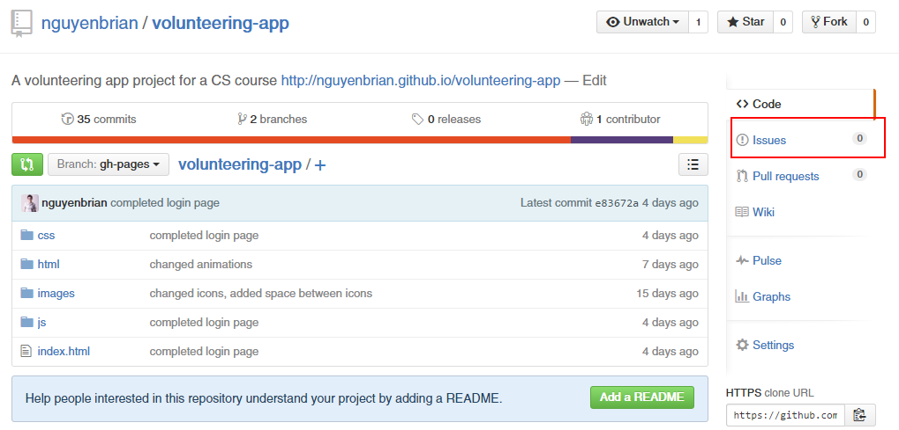

#### Contributor

Someone that contributes to the default branch through things such as commits,
pull requests and submitting issues.

## Follow us on GitHub!

- Brian: https://github.com/nguyenbrian
- Jevin: https://github.com/JevinSidhu
- Udit: https://github.com/uditdesai
- Vaibhav: https://github.com/vaibhavyadaram

## Explore!

There are tons of awesome projects people are creating on GitHub with some with
thousands and thousands of contributors! Here are just a few:

- https://github.com/rails/rails - Ruby on Rails
- https://github.com/atom/atom - Atom: GitHub's very own open-source code
  editor
