# Building Your First Website

Short link to this workshop: https://workshops.hackclub.io/portfolio

## Goals

Goals for this workshop:

- Make your personal website
- Put it on the internet for the whole world to see!

Your final design looks like this:

> 

Here is a link to a [live demo][final_output].

And here is the [final code][final_output_code] for the live demo.

To do this, you will be learning the basics of two languages: HTML and CSS.

Every website that you have ever seen are written in these two languages.

We will be building this website on an online code editor called JS Bin.

[final_output]: https://jsbin.com/gist/81d45193dab5236afbba?output
[final_output_code]: https://jsbin.com/gist/81d45193dab5236afbba?html,css,output

## Creating a GitHub account

Before we go to JS Bin, we want a GitHub account that we can use to signin with.

GitHub is a website used by many professional coders to collaborate on code.
Think Dropbox, but for code.

GitHub also has a login feature similar to how Facebook has "Facebook login".
Let's make a GitHub account so we can login to JS Bin and many websites in the
programming ecosystem!

### 1) In a new window, open [github.com][github]

> 

[github]: https://github.com

### 2) Create an account with a valid email

> 

### 3) Click "Sign up for GitHub"

> 

### 4) Ignore everything on the page and click "Finish sign up"

> 

And now we're done creating a GitHub account!

## Creating a JS Bin Account

Now that we have a GitHub account:

1. Open [jsbin.com][jsbin]
2. Click "Login or Register"

> 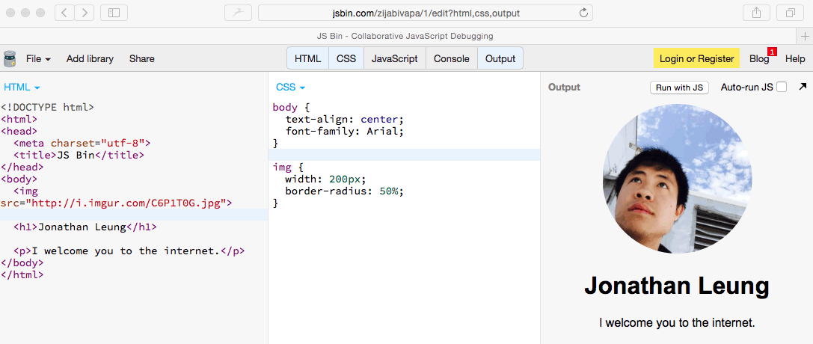

[jsbin]: https://jsbin.com

## 4) Login with GitHub

Now click "Authorize application"

> 

And we're all set!

## JS Bin is like Microsoft Word for Code

Just like you use Microsoft Word to write English, we can use JS Bin to write
code.

Go ahead and close the popup:

> 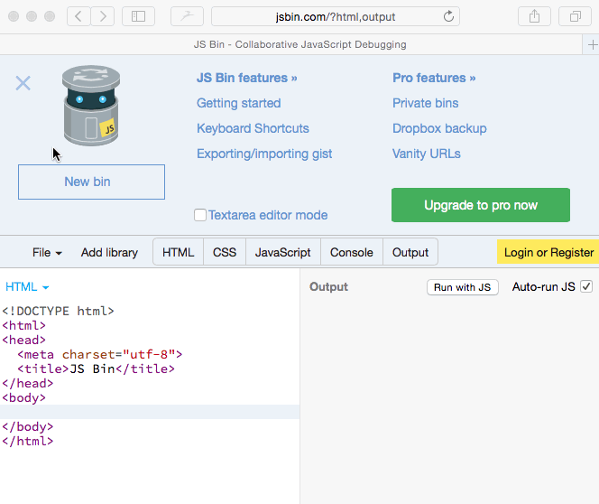

Then delete everything on the left. We don't need it right now.

> 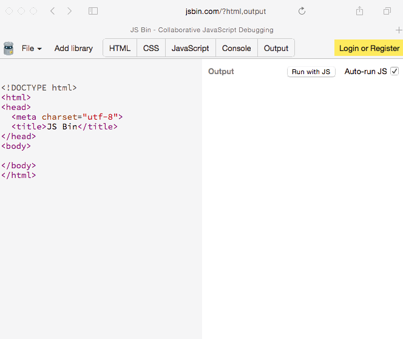

Then write your name in the text box. My name is `Jonathan Leung` so that's
what I will write:

> 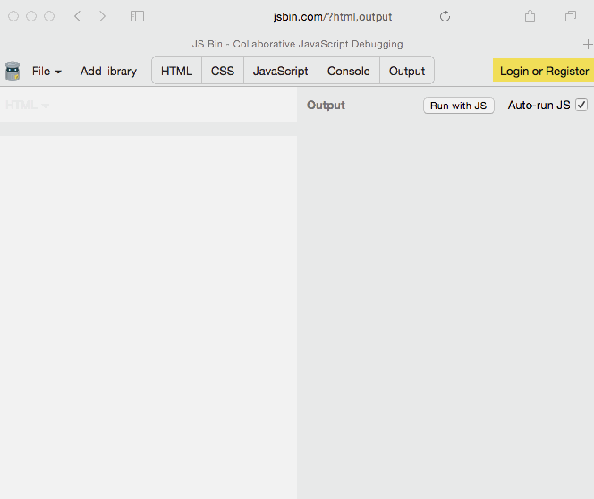

Notice that what you write on the left side of the screen is reflected
on the right.

> 

Note that we are writing "HTML" code.

> 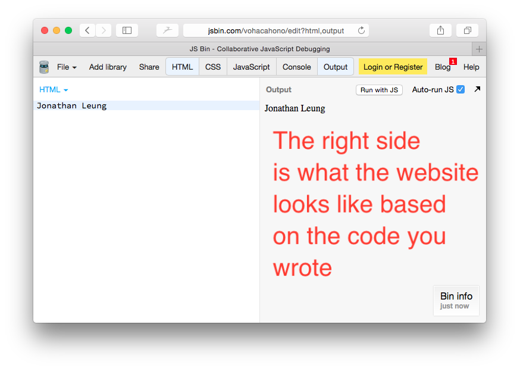

<!-- This is a link to the original image in case any changes
     want to be made in the future: 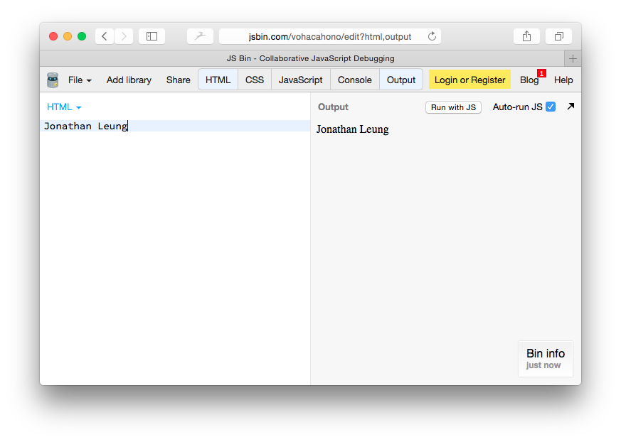 -->

Let's look at the final website to figure out what we need to do next:

> 

Ah, we also need to add a description! Let's add it!

## Adding the description

Go ahead and write a short 1 sentence description about yourself. Don't worry
about getting it perfect, you can always change it later!

> 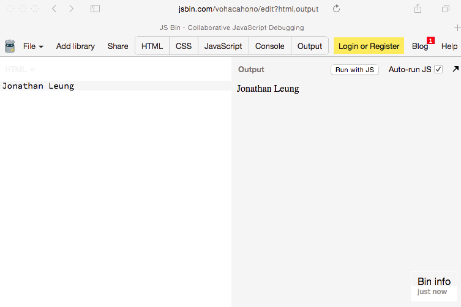

Hmm... It looks funny on the right side:

> 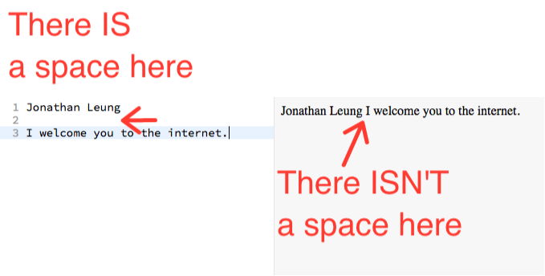

Let's understand why:

## HTML Tags

The code that we are writing on the left is called "HTML". (Feel free to [Google
what HTML stands for and learn more about it][google_html])

Any adding blank lines or more than one space between your words in HTML does
will not change what your website looks like.

However we can change the style of some things on the page by adding **HTML
tags**.

[google_html]: https://www.google.com/search?q=html

## The Heading HTML Tag

HTML "tags" are used to organize the content of a web page.

For example, if I want `Jonathan Leung` to be a heading of my webpage, I can
put it inside of a heading tag, like so:

```html
<h1>Jonathan Leung</h1>
```

Let's try it:

> 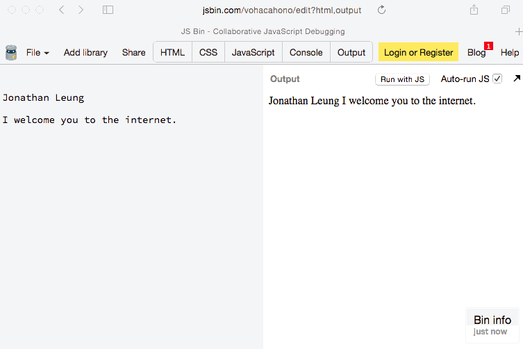

And voilà! This is our result:

> 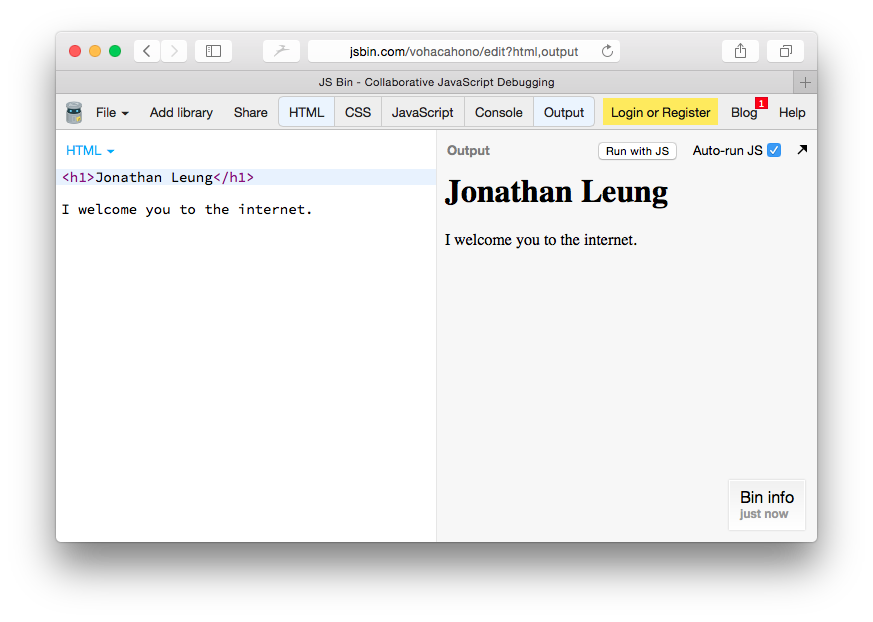

Hey, look, it's all big and bold!

### More about headings

There are six different heading tags, `h1` through `h6`.

The `h1` tag indicates that its text is the the most important and `h6` the
least important.

If we write out all the tags (don't bother doing this):

> 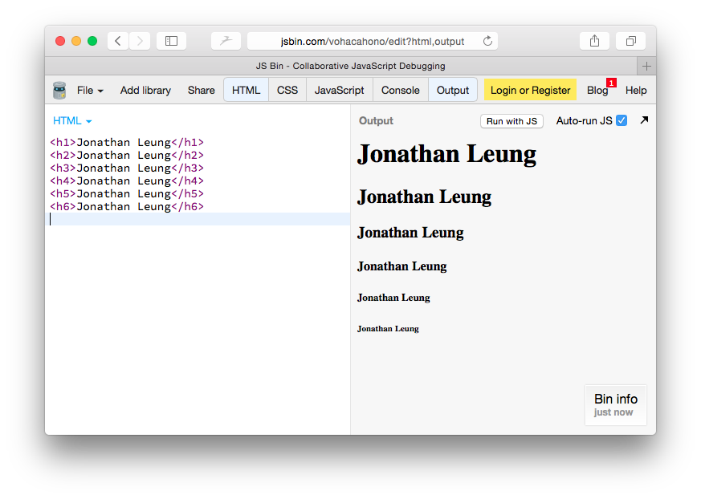

we see that the closer the tag is to h1, the larger the text.

### Some Terminology

```html
<h1>Jonathan Leung</h1>
^^^^
this is called the h1 tag
specifically it is the OPENING h1 tag
```

```html
<h1>Jonathan Leung</h1>
                  ^^^^^
                  this is the CLOSING h1 tag
```

Note that many HTML tags have both an "opening" and "closing tag"

**Next:**

Now we need to put the description in the appropriate tag:

> 

## The HTML Paragraph Tag

When you look at a different website, say the Wall Street Journal, we can see

> 

> 

We use the `h1` tag for headsings.

We use the `p` tag for paragraphs and the main text for a website.

For me, `I welcome you to the internet.` is the main text of my website.

So I would write:

`<p>I welcome you to the internet.</p>`

Like so:

> 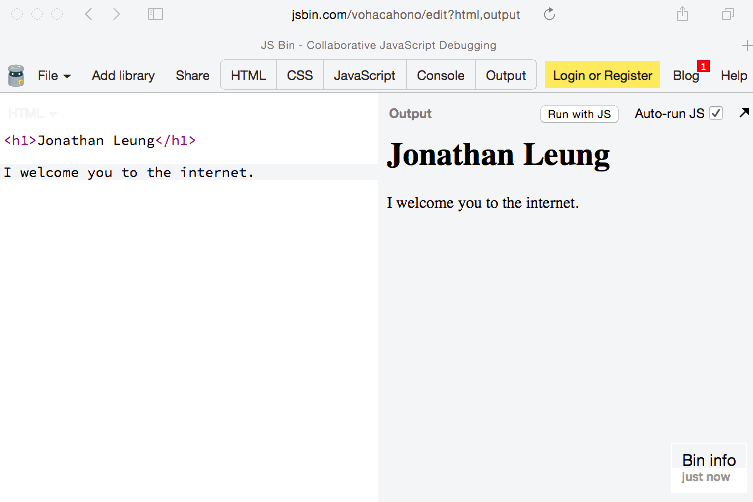

It doesn't look like much changed but it has!

> 

## Adding the image

To add an image, we use the image tag:

```html

```

Let's try adding a picture of me to the page (just for time's sake, let's just
use a picture of me and after you finish the tutorial, you can change it to a
picture of yourself).

This is a link to my picture:

```
http://i.imgur.com/C6P1T0G.jpg
```

Feel free to copy and paste that into JS Bin and do the following:

> 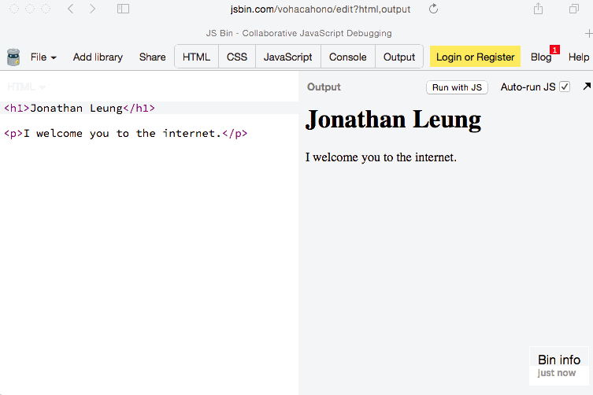

The image is taking a lot of room right now but if we scroll down on the right
side, we see that our original text is still there:

> 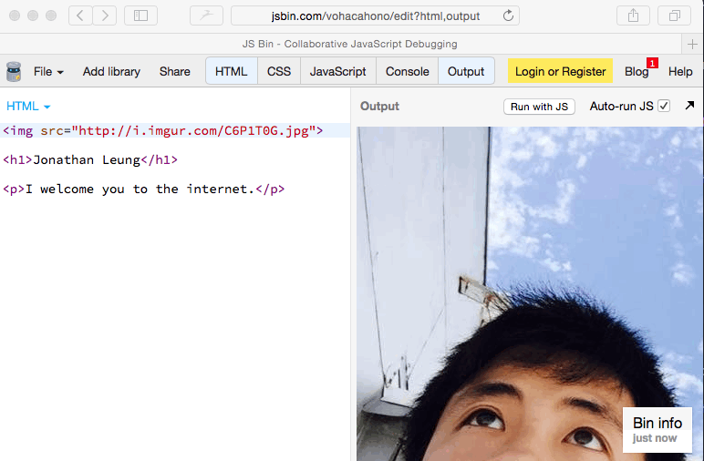

Ok. We need to make the picture smaller

But before we do that, let's understand how the image tag works:

```html

 ^ "img" is the tag name
```

```html


Note that  does not have a closing tag
```

```html

     ^^^^^^^^^^^^^^^^^^^^^^^^^^^^^^^^^^^^
     this part is an attribute
     of the image tag

     (think of attributes like settings)
```

For example, if an oven was a tag:

```html
<oven temperature="350">
```

- `temperature` is the name of the attribute
- `350` is the value of the `temperature` attribute


```html

     ^^^ "src" is the name of the attribute
         (think the name of the setting, like temperature)
```

```html

          ^^^^^^^^^^^^^^^^^^^^^^^^^^^^^^
          "http://i.imgur.com/C6P1T0G.jpg" is the value
          of the "src" attribute (think value of the setting like 350)
```

## Changing the look and feel with CSS

Ok. The image is way too big. We need to fix it.

So so far, we have only been adding content to the page and not really
changing its look and feel.

HTML is used for the content. There's this other language called CSS that we use
to change the way things look and feel.

So if we want to change the size of an image, we need to use CSS.

To write CSS code, click "CSS" in the menu:

> 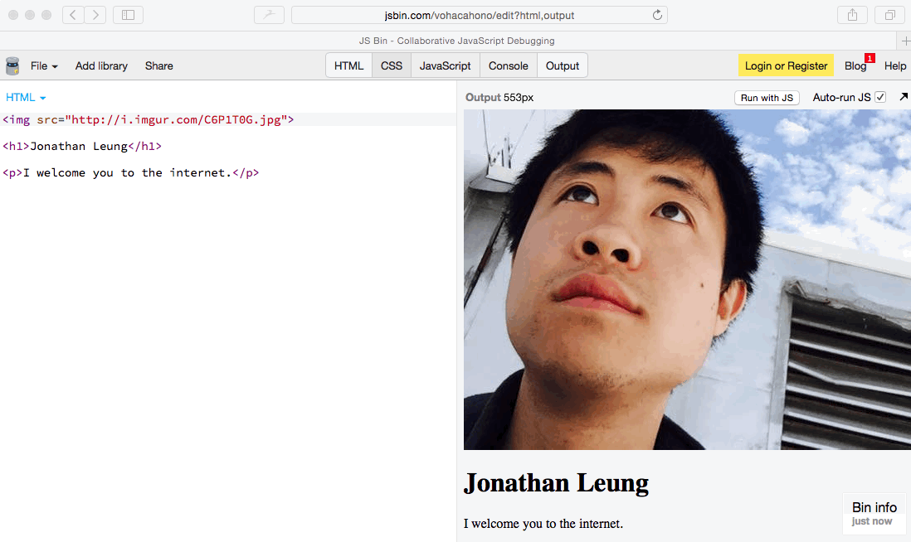

Type the the code in the CSS box (don't copy and paste code you want to
learn because you won't remember it!)

```css
img {
  width: 50%;
}
```

> 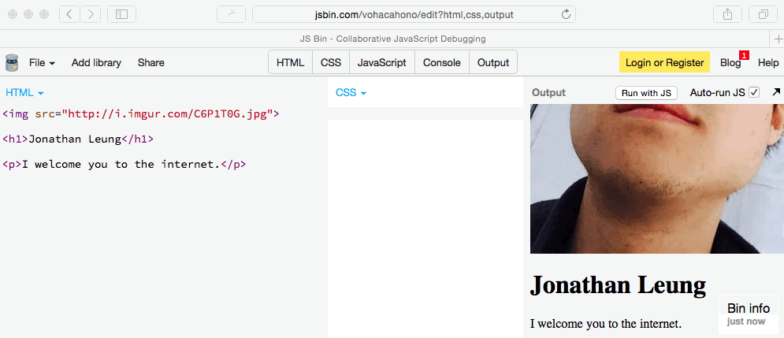

Cool! The image shrunk!

## The basics of CSS

Let's understand the code.

> 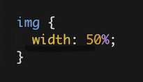

Read the following as one long sentence:

>  "For every `img` tag on the web page"

>  I want all the style properties inside the curly
> brackets to apply:

>  specifically, I want the width

> 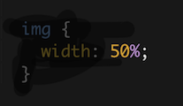 to be 50% of the width of the page.

**Vocabulary**

>  `img` is called the selector, it "selects" all
> of the `img` tags and applies all of the settings inside of the curly braces

>  `{` `}` are called curly braces

>  the thing on the left side of the semicolon
is called the `"property", in this case it is `width`

>  `50%` is what's known as the `"value"`

### But what happens if I resize the page?

> 

Hmm... I don't want my image to change sizes if my page changes sizes.

## Pixels

Let's change the units from a percentage to pixels.
This will now set the width of the image to always be `200px` or 200 pixels
no matter the size of the page.

> 

And if we try to resize the page:

> 

nothing happens.

## We've made good progress:

This is where we want to go:

> 

We're here right now:

> 

## Making the image a circle

While we're working on the image, let's make it nice and rounded.

We're going to use one of the most useful tools in programming to figure out how
to do this, the great and mighty Google.

To figure out how to make an image nice and rounded, I might Google something
like, `make image circular in css`

This is the first result I get

> 

I open it and see this site:

> 

I focus on this line:

> 

It seems like I just need to add

```javascript
border-radius: 50%;
```

Since I want this to apply my `img` tag, I add here:

> 

Hey! It works!

> If you have chosen to use an image that is not square (like the one we
> provided), you may notice that your image is not a perfect circle.
> Unfortunately there is not simple way to fix this with CSS, it is easier just
> to crop your image reupload it.

Note that this was just a brief introduction to using Google to figure out
how to do something. You will be doing this **_A LOT_** more of this in the
future.

## We've made more progress!

This is where we want to go:

> 

We're here right now:

> 

Now we have to:

- Center everything
- Change the font

## Adding the body tag

We want to center everything in the entire page.

1. We can add a tag called the `body` tag.
2. Put everything inside of the body tag.
3. Now that everything is inside the body tag, if we tell the CSS to center
   the body, it will center **everything** inside of the body.

### 1. We can add a tag called the `body` tag.

> 

### 2. Put everything inside of the body tag.

> 

### 3. Tell the CSS to center everything in the body tag.

> 

To go over the vocabulary of what we just did:

- We added the new tag, `body`
- This selects all the `body` elements on the page (there's only 1)
- And then we select the body tag and set one of it's properties, `text-align`,
  to `center`. This centers everything inside of the body tag

This is one way to center everything on the page.

This is what I added in the CSS. Again, don't copy and paste or else you won't
remember.

```css
body {
  text-align: center;
}
```

> 

## Changing the font

Now we also need to change the font:

We are going to use the font `Arial` (feel free to use another font as well)

> 

Here's what it looks like after the change:

> 

To go over the vocabulary of what we just did:

- We the `font-family` attribute to the `body` selector and set the value to
  `Arial`.

This changed the font for the text in the `h1` and `p` tag because they are
both inside of the `body` tag.

## Now for the final changes:

The website already looks complete but there are some things that are missing.

As an analogy, if I said the sentence "Me want apple.", you would know what I
meant but the sentence is gramatically wrong.

In the same way, Chrome understands the code that we have written even though
it is "gramatically" wrong. To make it gramatically correct we need to use the
tags that JS Bin initially gave us.

Let's open up a new tab and open JS Bin.

> 

For now, I wont explain what all this code means, you can

- Google for what it means
- Or ask someone else that might know what it means

Let's

1. Copy this starter code into our current project.
2. Move the code in our `body` tag into their `body` tag.
3. Delete our old `body tag`.

### 1. Copy this starter code into our current project.

> 

### 2. Move the code in our `body` tag into their `body` tag.

> 

### 3. Delete our old `body tag`.

> 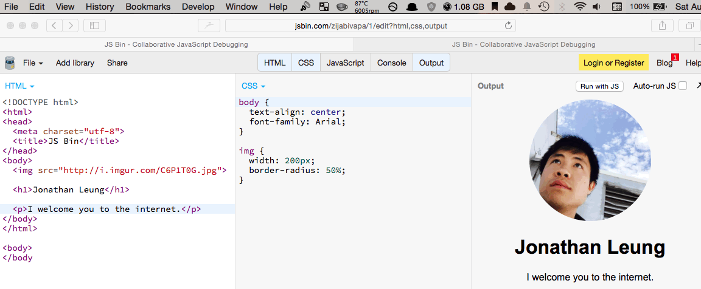

Huzzah! We did it! We're done!

## Get a link that everyone can see

Now that you're logged in, JS Bin will not "turn off" your website.

So if you get the output URL, you can share this with everyone on the
entire internet now and they will be able to see your website!

> 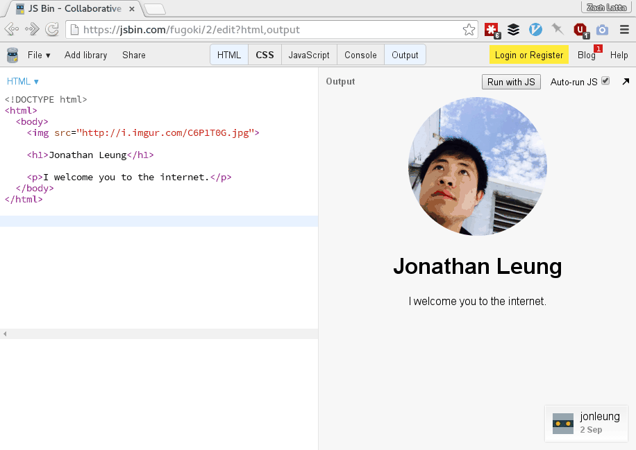

## Done!

Huzzah, we did it! You can take this URL and share it with your friends now!

> 

One last thing. Please click a rating below to rate this workshop. It'll only
take 3 seconds.

_How likely is it that you would recommend this workshop to a friend?_

| [1][r1] | [2][r2] | [3][r3] | [4][r4] | [5][r5] | [6][r6] | [7][r7] | [8][r8] | [9][r9] | [10][r10] |
| ------- | ------- | ------- | ------- | ------- | ------- | ------- | ------- | ------- | --------- |

[r1]: https://feedback-redir.hackclub.io/1uKf7qYDyqvQ_V5bsfv-UPx7uBhdF8qzqT8zFUIJh9eI?ip=entry.78173348&rfield=entry.559841237&r=1
[r2]: https://feedback-redir.hackclub.io/1uKf7qYDyqvQ_V5bsfv-UPx7uBhdF8qzqT8zFUIJh9eI?ip=entry.78173348&rfield=entry.559841237&r=2
[r3]: https://feedback-redir.hackclub.io/1uKf7qYDyqvQ_V5bsfv-UPx7uBhdF8qzqT8zFUIJh9eI?ip=entry.78173348&rfield=entry.559841237&r=3
[r4]: https://feedback-redir.hackclub.io/1uKf7qYDyqvQ_V5bsfv-UPx7uBhdF8qzqT8zFUIJh9eI?ip=entry.78173348&rfield=entry.559841237&r=4
[r5]: https://feedback-redir.hackclub.io/1uKf7qYDyqvQ_V5bsfv-UPx7uBhdF8qzqT8zFUIJh9eI?ip=entry.78173348&rfield=entry.559841237&r=5
[r6]: https://feedback-redir.hackclub.io/1uKf7qYDyqvQ_V5bsfv-UPx7uBhdF8qzqT8zFUIJh9eI?ip=entry.78173348&rfield=entry.559841237&r=6
[r7]: https://feedback-redir.hackclub.io/1uKf7qYDyqvQ_V5bsfv-UPx7uBhdF8qzqT8zFUIJh9eI?ip=entry.78173348&rfield=entry.559841237&r=7
[r8]: https://feedback-redir.hackclub.io/1uKf7qYDyqvQ_V5bsfv-UPx7uBhdF8qzqT8zFUIJh9eI?ip=entry.78173348&rfield=entry.559841237&r=8
[r9]: https://feedback-redir.hackclub.io/1uKf7qYDyqvQ_V5bsfv-UPx7uBhdF8qzqT8zFUIJh9eI?ip=entry.78173348&rfield=entry.559841237&r=9
[r10]: https://feedback-redir.hackclub.io/1uKf7qYDyqvQ_V5bsfv-UPx7uBhdF8qzqT8zFUIJh9eI?ip=entry.78173348&rfield=entry.559841237&r=10
