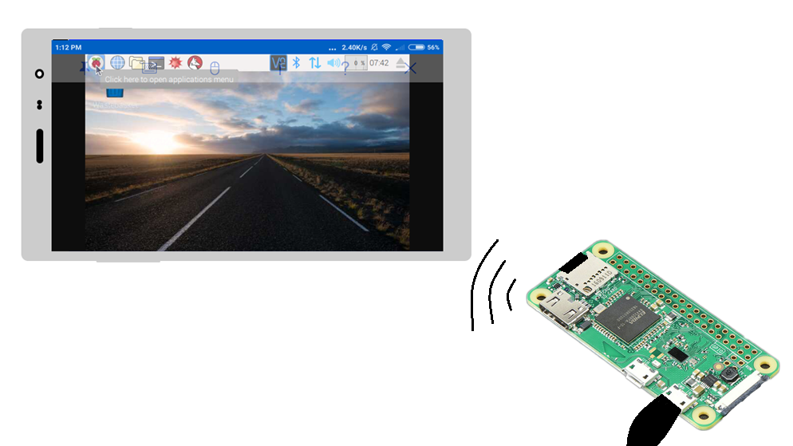
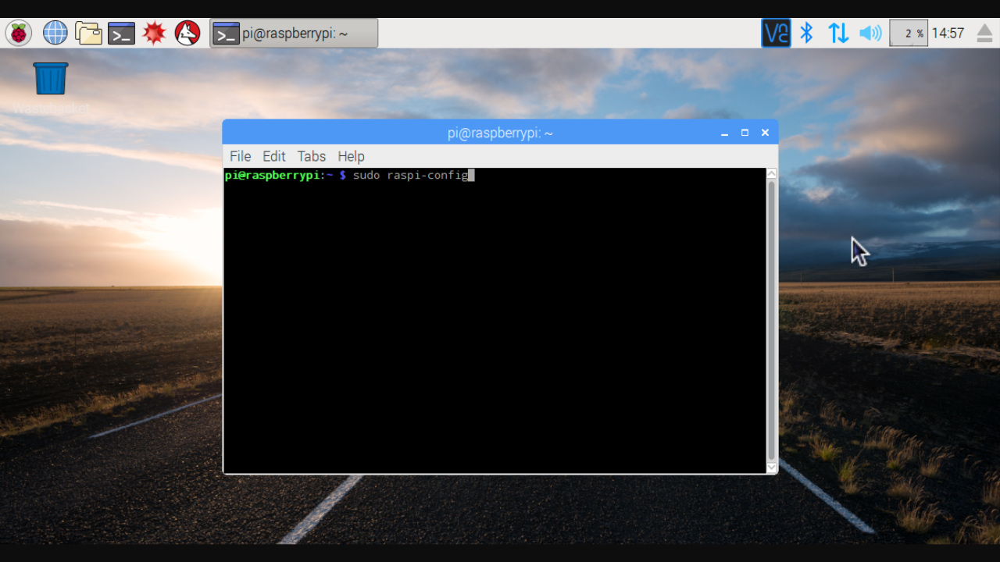
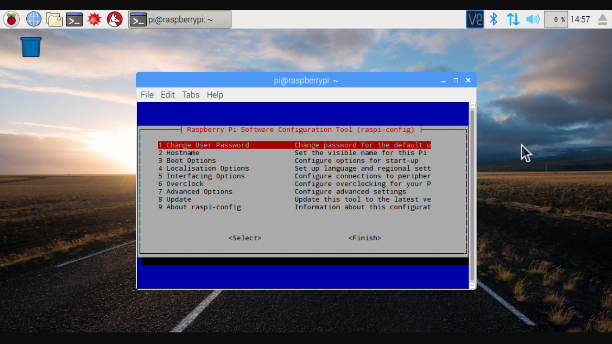
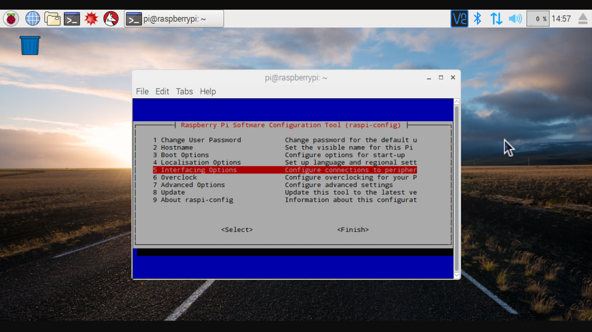
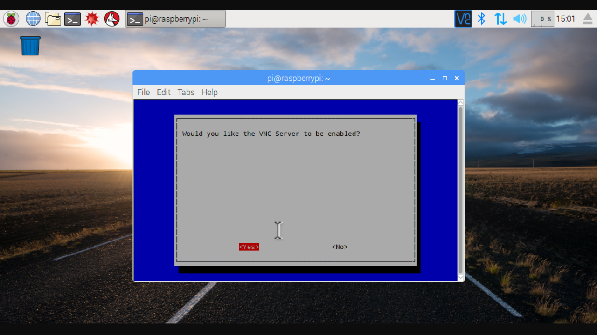
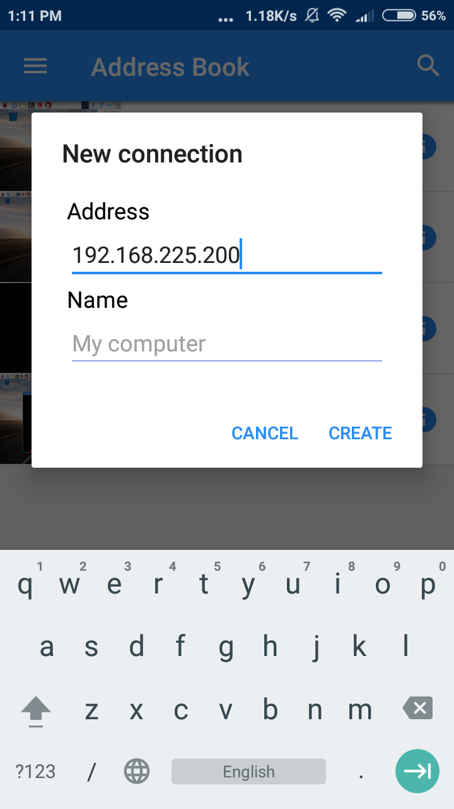
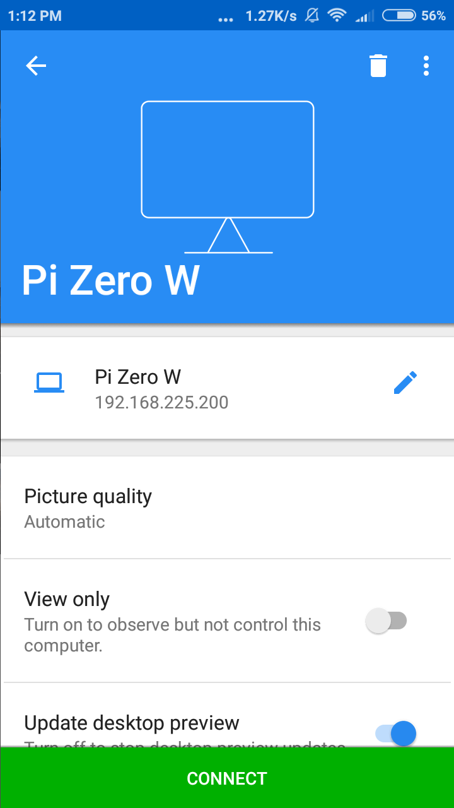
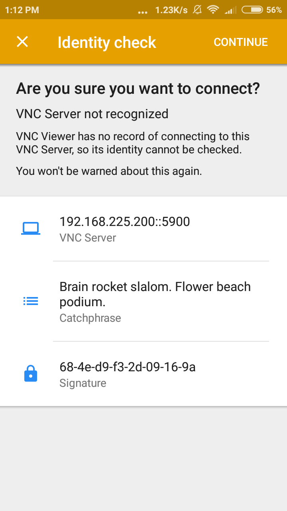
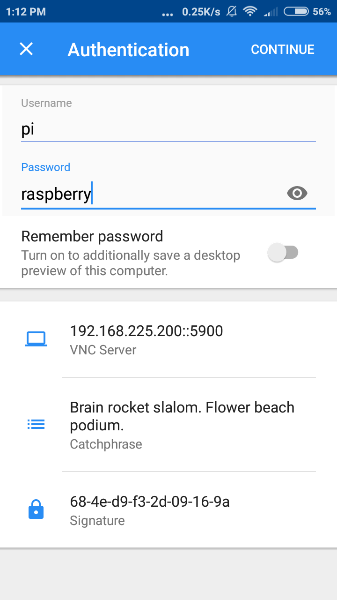
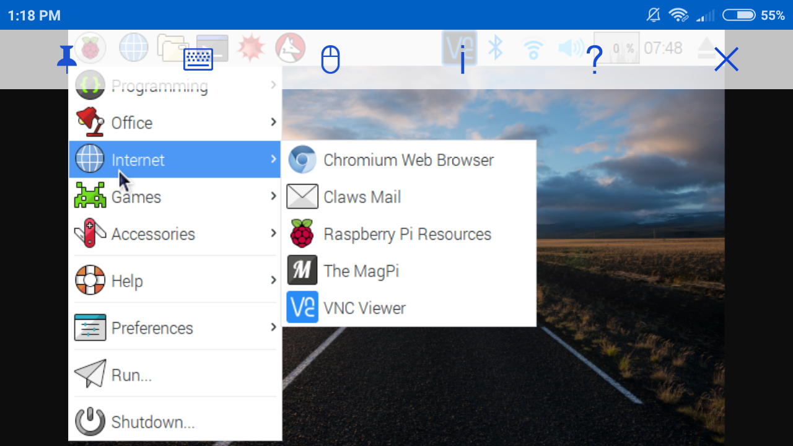

# Remote viewing with VNC on Raspberry Pi

While building a project with Raspberry Pi it is not always easy to use a monitor with it to view or control. For this, there is a remote desktop viewing feature available on Raspbian OS. It basically lets you control or view your Raspbian desktop on a network-connected PC or smartphone. The application used is [RealVNC](https://www.realvnc.com/en/).

## Setting Up VNC server on Raspberry Pi

- Raspberry Pi setup with monitor, keyboard & mouse
- A network connected PC or Smartphone
- RealVNC software for PC/Smartphone

Open the terminal available on Raspbian and type in

    sudo apt-get update

This command make's sure Raspbian is up to date. Wait till the command is executed.

After it is done,type in the command given below.

    sudo raspi-config

This command opens this configuration window in the terminal.

Using the arrow key get down to Interface options and click select using the arrow key and press enter.

Select VNC in the upcoming window and enable it and click finish.That's it you have enabled VNC in your Pi

## Setting up VNC viewer on the PC/Smartphone

Install VNC app from the [Google Play Store](https://play.google.com/store/apps/details?id=com.realvnc.viewer.android&hl=en). If you are using your PC go to this site to [download](https://www.realvnc.com/en/connect/download/viewer/) VNC viewer

*Note: Connect your PC/smartphone to the same network as that of the Pi*

Open VNC app and click the **+** icon and type the IP address of your Pi.

To find the IP address of your Pi follow the steps mentioned in this site

[https://www.raspberrypi.org/documentation/remote-access/ip-address.md](https://www.raspberrypi.org/documentation/remote-access/ip-address.md)

Click connect and it will ask you whether you want to connect click continue and then type the username as **pi** and password as **raspberry** and click continue

You will be welcomed with the wonderful UI of Raspbian.

In the same way you can also use the VNC viewer software available for PC.
