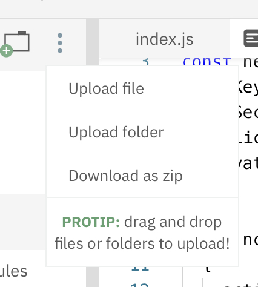

**This workshop requires advance preparation by a club leader. If you are a club leader, [click here]() to view the preparation steps.**

[](https://www.youtube.com/watch?v=dQw4w9WgXcQ)

Rickrolling has been around since the early days of the Internet. But have you ever wanted to take rickrolling to the next level, into the real world? That’s what you’re going to do today. In this workshop, you’re going to build a Node.js web app.js that calls your phone and rickrolls you.

## Getting started
Nexmo is a service that provides easy-to-use phone APIs—SMS, voice, etc. If you’ve ever heard of Twilio, it’s a lot like that. We’re going to use the Nexmo Voice API to place a call and play an audio stream.

Start a new Node.js project on repl.it by vising [repl.it/languages/nodejs](https://repl.it/languages/nodejs).
 
The first thing we need to do is authenticate with the Nexmo API. Your club leader should have created an account for your club and generated an API key, API secret, Application ID, and a private key stored as a file.

In order to make sensitive details private, we use environment variables. Environment variables are essentially “secret” variables: the server knows what they are, but they’re not in the code for anyone to see. Environment variables are stored in a `.env` file. If you create a `.env` file on repl.it, that file will only be visible to you. When you want to refer to an environment variable in your code, you use `process.env.ENV_VARIABLE_NAME`.

Let’s take advantage of this feature by creating a `.env` file and storing the keys we need to authenticate with Nexmo. Once you’ve created a new `.env.` file, get the API key, API secret, and Application ID from your club leader and add them to the file:

```
API_KEY=aPIkEyFrOmYouRcLuBLeaDEr
API_SECRET=aPisECReTfROmyOURcluBLeAdER
APP_ID=application-id-from-your-club-leader
```

Now, let’s navigate back to `index.js` and set up Nexmo. The first step is to import the Nexmo npm package:

```js
const Nexmo = require(‘nexmo’)
```

Next, let’s authenticate with Nexmo:

```js
const nexmo = new Nexmo({
  apiKey: process.env.API_KEY,
  apiSecret: process.env.API_SECRET,
  applicationId: process.env.APP_ID,
  privateKey: 'private.key',
})
```

Instead of offering a private key in plain text, Nexmo saves generated private keys in a file called `private.key` that you have to upload manually to the server your app is being hosted on. Obtain the `private.key` file from your club leader and download it to your computer. Then, upload the file to repl.it by clicking on the three dots at the top left of your screen and clicking “Upload file”.



Once your `private.key` file is uploaded, you’re all set to start making calls!

## Making a call
