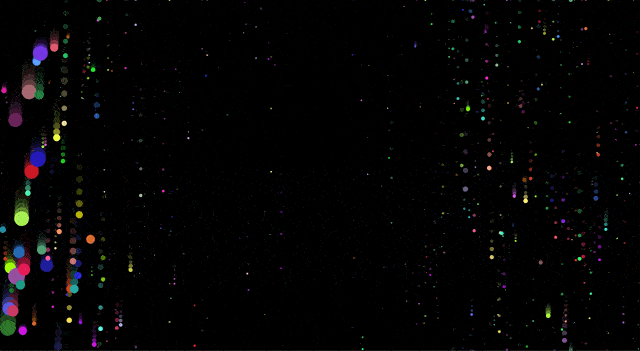

Sound visualization is one of the coolest things that modern-day web development tools have made accessible. There’s something indescribably satisfying about the surreal feeling of *seeing* the sounds around you on your screen and somehow understanding what you’re seeing.



In this workshop, you’re going to make it rain colorful particles that are created from the sounds from your microphone, in under 70 lines of code. Along the way, you’ll learn how to use:

1. JavaScript objects
2. JavaScript prototypes
3. Fast Fourier Transform

**(FYI: this workshop assumes you’re familiar with arrays and for loops.)**

Sound overwhelming? Exciting? Scary? If so, you’re ready go. Let’s get started.

## Getting started
We’re going to be using [p5.js](https://p5js.org), a JavaScript library for creative coding, to make this project. This project requires two separate p5.js libraries: `p5.js` and `p5.sound.js`.

Start a new HTML project on repl.it at [repl.it/languages/html](https://repl.it/languages/html). Then, just before the end of your `<head>` tag, import these two libraries:

```html
<script src="https://cdnjs.cloudflare.com/ajax/libs/p5.js/0.10.2/p5.min.js"></script>
<script src="https://cdnjs.cloudflare.com/ajax/libs/p5.js/0.10.2/addons/p5.sound.js"></script>
```

Great, we’ve got p5 imported! We’re almost ready to start writing JavaScript. One more thing: navigate to the `style.css` file and add the following:

```css
body {
  padding: 0;
  margin: 0;
}
```

This will ensure that the p5 canvas we’re about to create will cover our entire screen.

## About the Fast Fourier Transform
At the center of everything we’re building in this workshop is something called a Fourier Transform: a mathematical operation that takes a frequency (e.g. the sound frequency picked up by your computer’s microphone) and decomposes it into the individual wavelengths that make it up. A Fast Fourier Transform—the algorithm we’re using in this workshop—quickly performs a Fourier Transform. You don’t need to understand how the Fast Fourier Transform works—we can easily use it with p5 without understanding it—but if you’re interested, 3Blue1Brown made [a great video](https://youtu.be/spUNpyF58BY) explaining it. We’re going to use the Fast Fourier Transform to draw our particles.

## Setting up p5
Navigate to your `script.js` file and add the following variables to the top of the file:

```js
const binCount = 1024
let particles = new Array(binCount)
let fft
```

1. `binCount` is the number of frequency bins in the Fourier Transform. You don’t need to know what this means—for our purposes, this just means the maximum number of particles that can be drawn.
2. `particles` is an array with 1024 (currently empty) spaces.
3. `fft` is the Fast Fourier Transform variable that we will assign a value to in a second.

p5.js has two main functions: `setup()` and `draw()`. Let’s create these two functions:

```js
const binCount = 1024
let particles = new Array(binCount)
let fft

function setup() {

}

function draw() {

}
```

In the `setup()` function, let’s create a canvas and turn on our microphone:

```js
function setup() {
  createCanvas(windowWidth, windowHeight)
  noStroke()
  
  let mic = new p5.AudioIn()
  mic.start()
}
```

`noStroke()` disables drawing an outline on the shapes that we create inside the canvas.

Next, let’s initialize the `fft` variable we created earlier.

```js
function setup() {
  createCanvas(windowWidth, windowHeight)
  noStroke()
  
  let mic = new p5.AudioIn()
  mic.start()
  
  fft = new p5.FFT()
  fft.setInput(mic)
}
```

Let’s quickly take a step back and think about what we want to happen in this project:

1. p5 listens for microphone input
2. p5 performs the FFT algorithm on the audio it receives. The FFT algorithm will output an array of wavelengths 1024 entries long.
3. A particle is created for each entry in the FFT array, with its size, speed, and location on the canvas corresponding to the entry
4. The particle is drawn

Since we’ll be creating many “particles” with the same properties, it makes sense to create a Particle object. Before your `setup()` function, add this:

```js
let Particle = function(position) {

}
```

We want to give each Particle the same set of properties. I’m thinking:

- `position`, so that each particle is created at a given position
- `speed`, so we can make the particles move
- `color`, so that each particle has a unique color

```js
let Particle = function(position) {
  this.position = position
  this.speed = createVector(0, random(0, 10))
  this.color = [random(0, 255), random(0,255), random(0,255)]
}
```

Our `speed` is represented as a vector: it has both a horizontal speed and a vertical speed. We don’t want our particles to move horizontally, so for now, our speed is a random number between 1 and 10 in the vertical direction.

Our `color` is a random number on the [RGB system](https://www.w3schools.com/colors/colors_rgb.asp).