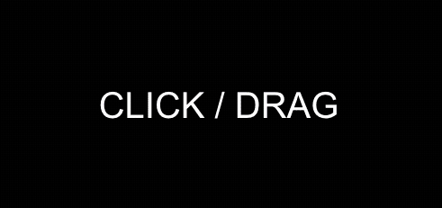
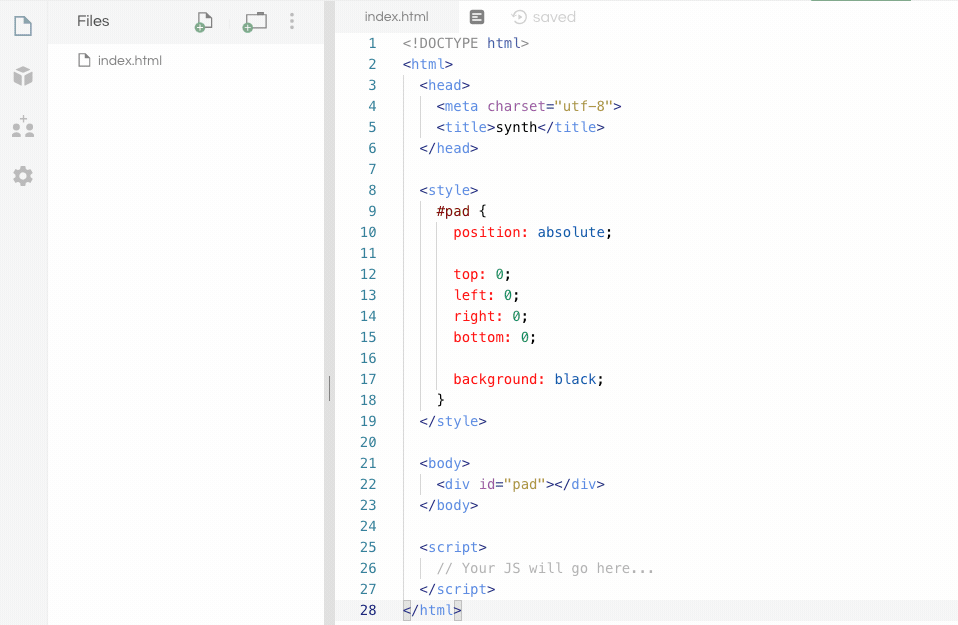
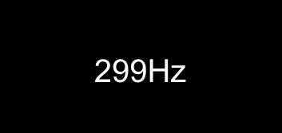

# Synth Pad

Let's make a synth pad, using simple HTML and a fun javascript package called Tone.js.

## My Version:

[Live Version](https://synth--polytrope.repl.co) | [Source Code](https://repl.it/@polytrope/synth)



## Getting Started

Open up a new HTML project here: https://repl.it/languages/html

Delete _everything_. You should be left with a blank `index.html` file and that's it:


We're going to do everything in one file, for the sake of simplicity.

Set up your `index.html` like this:

```html
<!DOCTYPE html>
<html>
  <head>
    <meta charset="utf-8">
    <title>synth</title>
  </head>

  <style>
    /* Your CSS will go here... */
  </style>

  <body>
    <!-- Your HTML will go here... -->
  </body>

  <script>
    // Your JS will go here...
  </script>
</html>
```

## HTML

First let's do our HTML. Our synth pad will be one big button, so the HTML is just a single `div` named "pad":

```html
<body>
  <div id="pad"></div>
</body>
```

Now if you run the page, you get... nothing. So let's give that pad some style.

## CSS

We want the pad to occupy the whole page, so we're going to set it to `position: absolute;`. This gives us full control over this div's position and size, instead of placing it relative to its neighbors.

Then we'll set `top`, `left`, `right`, and `bottom` all to 0. This means there will be zero pixels between each side of the div and the browser window (in other words, it fills the page).

Finally, we'll set `background: black;` so you can actually see it.

Your `style` section should now look like this:

```html
<style>
  #pad {
    position: absolute;

    top: 0;
    left: 0;
    right: 0;
    bottom: 0;

    background: black;
  }
</style>
```

Now if you run the page, you should get a big black rectangle. Which is pretty exciting.

## JavaScript

Let's make some noise using Tone.js. Search for "Tone" in the Packages tab and click the Plus icon. Repl.it will insert a snippet of code into your file that tells a browser to load Tone.js with this page.



Let's add some code to make Tone do something simple. Try putting this into your `script` section:

```html
<script>
  var synth = new Tone.Synth().toMaster();

  synth.triggerAttack(400);
</script>
```

The first line creates a new synthesizer and plugs it into your speakers. The second line triggers a note at 400Hz. Go ahead and run your page.

You should hear a super annoying noise. If you are not annoyed, either your sound is off or something got mixed up in your code. This is what you should have so far:

```html
<!DOCTYPE html>
<html>
  <head>
    <meta charset="utf-8">
    <title>synth</title>
  </head>

  <style>
    #pad {
      position: absolute;

      top: 0;
      left: 0;
      right: 0;
      bottom: 0;

      background: black;
    }
  </style>

  <body>
    <div id="pad"></div>
  </body>

  <script src="https://cdnjs.cloudflare.com/ajax/libs/tone/13.3.11/Tone.min.js"></script>

  <script>
    var synth = new Tone.Synth().toMaster();

    synth.triggerAttack(400);
  </script>
</html>
```

(to make it stop, refresh the page.)

## Adding Click/Touch with "Pointer Events"

Ok, now we need a way to turn our tone on and off. Delete that `synth.triggerAttack(400);`. We're going to replace it with two _functions_ and two _listeners_—the functions will turn the synth on and off, and the listeners will activate those functions when a _pointer_ (mouse or finger) goes down or up on the page:

```js
function down(event) {
  synth.triggerAttack(400);
}
function up(event) {
  synth.triggerRelease();
}

pad.addEventListener("pointerdown", down);
pad.addEventListener("pointerup", up);
```

Now if you run your page, the synth should respond to a click!

## Adding a Range of Pitches

It's kind of boring to make just _one_ pitch though. What if the left side of the page was a low pitch, and the right side was a high pitch?

To do that, we need to know where the pointer is.

Our `down` function takes in a variable called `event`, which contains data about our click—including where it happened. To get the number of pixels from the left side of the page, we use `event.pageX`. Get that value and plug it into `synth.triggerAttack` like so:

```js
function down(event) {
  var x = event.pageX;
  synth.triggerAttack(x);
}
```

Now if you run your page, you should get a low pitch by clicking on the left and a high pitch by clicking on the right!

## Adding a Pitch Label

Ok, so what if we want to know exactly what pitch we're making? Let's add a label to make that clear.

Inside your synth pad, add one more div, call it "label", and put CLICK / DRAG inside (we're going to add some dragging action later):

```html
<body>
  <div id="pad">
    <div id="label">CLICK / DRAG</div>
  </div>
</body>
```

Our new label needs some style. Add this to your `style` section to change the text's font, size, and color:

```css
#label {
  font: 40px Arial;
  color: white;
}
```

Now if you run the page you should get a big white "CLICK / DRAG" in the upper-left corner. Let's put that in the middle of the page.

To center our text, we need to add three new properties to the `#pad` div:

- `display: flex;`, which lets `#pad` automatically resize/center things
- `justify-content: center;`, which makes anything inside `#pad` left/right-centered
- `align-items: center;`, which makes anything inside `#pad` top/bottom-centered

Your whole style section should now look like this:

```html
<style>
  #pad {
    position: absolute;

    top: 0;
    left: 0;
    right: 0;
    bottom: 0;

    background: black;

    display: flex;
    justify-content: center;
    align-items: center;
  }

  #label {
    font: 40px Arial;
    color: white;
  }
</style>
```

Now your text should be neatly centered—the only problem is that all it says is "CLICK / DRAG".

When we trigger `down`, we want it to change our label to show the pitch. When we trigger `up`, we want it to reset to "CLICK / DRAG".

To change the text inside our label, first we need to grab that label element in javascript. Add this to the top of your `script` section:

```js
var label = document.getElementById("label");
```

Now add this to your `down` function to insert your pitch:

```js
label.innerHTML = Math.round(x) + "Hz";
```

And add this to your `up` function to reset it:

```js
label.innerHTML = "DRAG";
```

Your whole `script` section should now look like this:

```html
<script>
  var synth = new Tone.Synth().toMaster();
  var label = document.getElementById("label");

  function down(event){
    var x = event.pageX;
    synth.triggerAttack(x);
    label.innerHTML = Math.round(x)+"Hz";
  }
  function up(event){
    synth.triggerRelease();
    label.innerHTML = "CLICK / DRAG";
  }

  pad.addEventListener("pointerdown", down);
  pad.addEventListener("pointerup", up);
</script>
```

When you run the page, you should now see the frequency of the pitch you're playing!

## Adding Drag

Now to add that drag feature. For this we need one more function like `up` and `down` called `move`:

```js
function move(event) {
  var x = event.pageX;
  synth.setNote(x);
  label.innerHTML = Math.round(x) + "Hz";
}
```

Notice that this one looks a lot like `down`. It gets the X position of the pointer, and sets the label text to match the pitch. The only difference is that it calls `synth.setNote(x)` instead of `synth.triggerAttack(x)`, since we're just _changing_ the pitch—not starting a new note.

Like `up` and `down`, we also need a listener for `move`:

```js
pad.addEventListener("pointermove", move);
```

Now when you run your page, you should be able to click and drag to change pitch!



Ok, one last detail: When you mouse over your page it will trigger `move` and show a frequency, even if you haven't clicked yet. So we just need one more variable to know whether we are dragging. So add a variable for that at the top of your `script` section:

```js
var dragging = false;
```

Put this in your `down` function:

```js
dragging = true;
```

Put this in your `up` function:

```js
dragging = false;
```

And wrap everything in your `move` function with this:

```js
if (dragging) {
  // your move code
}
```

Now your script section should look something like this:

```html
<script>
  var synth = new Tone.Synth().toMaster();
  var label = document.getElementById("label");
  var dragging = false;

  function down(event){
    dragging = true;
    var x = event.pageX;
    synth.triggerAttack(x);
    label.innerHTML = Math.round(x)+"Hz";
  }
  function up(event){
    dragging = false;
    synth.triggerRelease();
    label.innerHTML = "CLICK / DRAG";
  }
  function move(event){
    if (dragging) {
      var x = event.pageX;
      synth.setNote(x);
      label.innerHTML = Math.round(x)+"Hz";
    }
  }

  pad.addEventListener("pointerdown", down);
  pad.addEventListener("pointerup", up);
  pad.addEventListener("pointermove", move);
</script>
```

Go ahead and try it out. If everything is set up right, you should have a fully-functional sliding synthesizer!

## That's All Folks!

For reference, here's my whole `index.html` file at the end of writing this:

```html
<!DOCTYPE html>
<html>
  <head>
    <meta charset="utf-8">
    <title>synth</title>
  </head>

  <style>
    #pad {
      position: absolute;

      top: 0;
      left: 0;
      right: 0;
      bottom: 0;

      background: black;

      display: flex;
      justify-content: center;
      align-items: center;
    }

    #label {
      font: 40px Arial;
      color: white;
    }
  </style>

  <body>
    <div id="pad">
      <div id="label">CLICK / DRAG</div>
    </div>
  </body>

  <script src="https://cdnjs.cloudflare.com/ajax/libs/tone/13.3.11/Tone.min.js"></script>

  <script>
    var synth = new Tone.Synth().toMaster();
    var label = document.getElementById("label");
    var dragging = false;

    function down(event){
      dragging = true;
      var x = event.pageX;
      synth.triggerAttack(x);
      label.innerHTML = Math.round(x)+"Hz";
    }
    function up(event){
      dragging = false;
      synth.triggerRelease();
      label.innerHTML = "CLICK / DRAG";
    }
    function move(event){
      if (dragging) {
        var x = event.pageX;
        synth.setNote(x);
        label.innerHTML = Math.round(x)+"Hz";
      }
    }

    pad.addEventListener("pointerdown", down);
    pad.addEventListener("pointerup", up);
    pad.addEventListener("pointermove", move);
  </script>
</html>
```

If you check out the "original" version I put at the top, you might notice a few differences—like pretty colors and a different sound. Check out my [source code](https://repl.it/@polytrope/synth) to see how I did those, and try adding some new features of your own!
