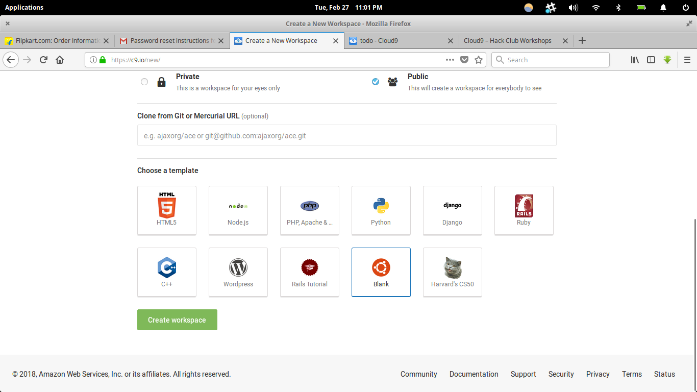
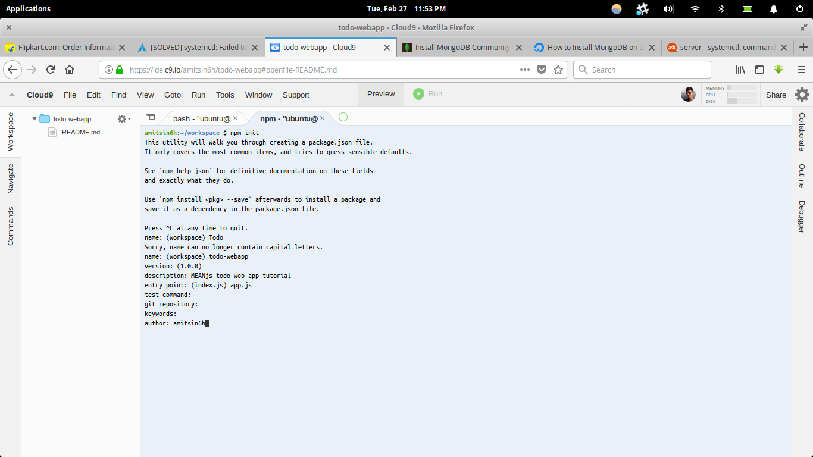
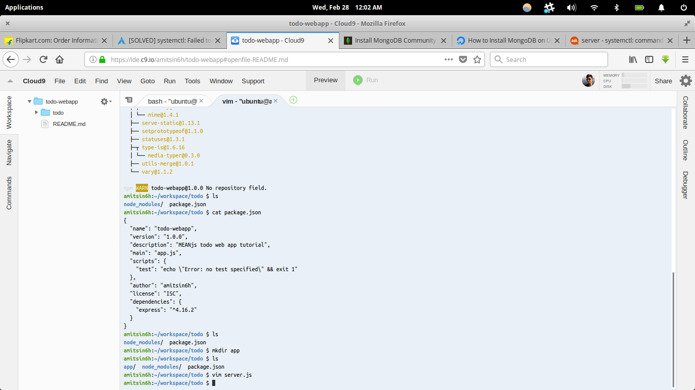
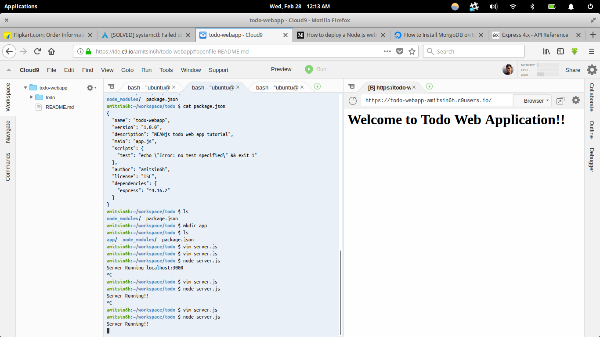
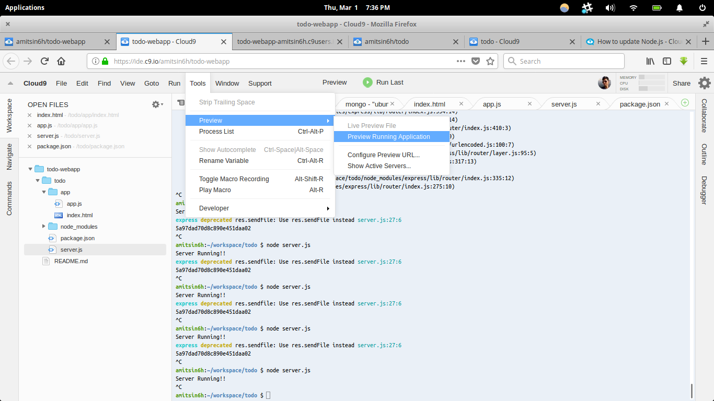
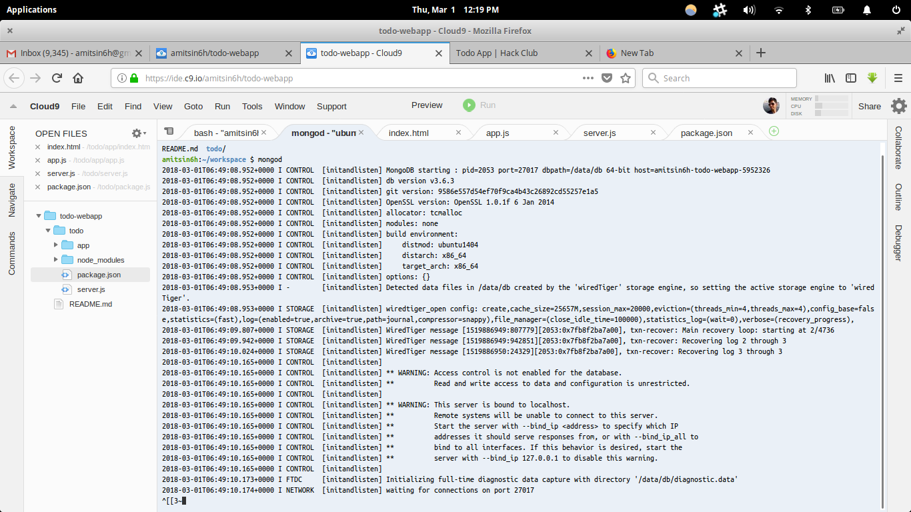
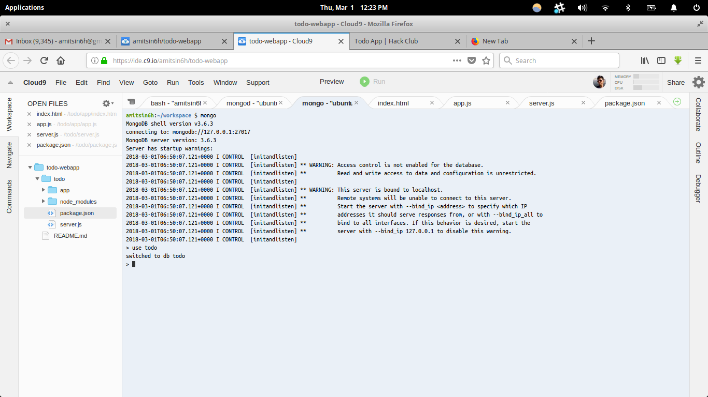
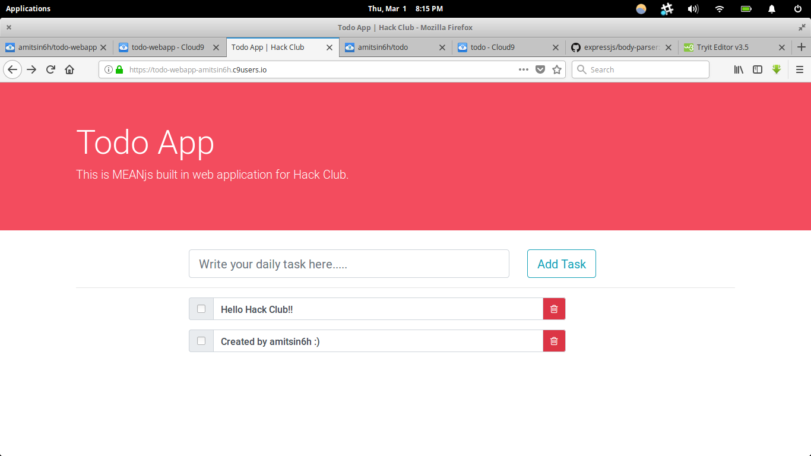

# ToDo MEAN.JS Application

Short link to this workshop: https://workshops.hackclub.com/todo_meanjs

**What you'll build:**


Here's a link to the [live demo][live_demo] and the [final code][final_code]. This workshop should take around 1-2 hour.

_**We recommend going through this workshop in Google Chrome or Mozilla Firefox.**_

[live_demo]: https://todo-webapp-amitsin6h.c9users.io/
[final_code]: https://github.com/amitsin6h/todo-mean-app

---

## About the Application

In this workshop we'll be creating a ToDo app using MEAN.JS. This ToDo app will have feature like create task and once we complete our task we can delete it. 

## Let's Start:

Before we start to code lets us first understand few things to get our basics clear.

**So what is MEAN **

So, basically MEAN stands for:

- MongoDB
- Express
- AngularJS
- NodeJS

**Now the question is what are these:**

- **MongoDB:** MongoDB is the leading NoSQL database, empowering businesses to be more agile and scalable.
- **Express:** Express is a minimal and flexible node.js web application framework, providing a robust set of features for building single and multi-page, and hybrid web applications.
- **AngularJS:** AngularJS lets you extend HTML vocabulary for your application. The resulting environment is extraordinarily expressive, readable, and quick to develop.
- **Node.js:** Node.js is a platform built on Chrome's JavaScript runtime for easily building fast, scalable network applications.

**Requirements**

| Cloud9 Blank Project    |
| ----------------------- |
|  |

- Cloud9 with blank Ubuntu project
- Brain

**Table of Contents**

- [Part I: Setting up Node.js](#part-i-setting-up-nodejs)
- [Part II: Installing MongoDB](#part-ii-installing-mongodb)
- [Part III: Building Project](#part-iii-building-project)
- [Part IV: Installing Express](#Part-iv-installing-express)
- [Part V: Starting our Node.js Server](#part-v-starting-our-nodejs-server)
- [Part VI: Creating Frontend using AngularJS](#part-vi-creating-frontend-using-angularjs)
- [Part VII: Creating Our Database](#part-vii-creating-our-database)
- [Part IX: Installing Body-Parser](#part-ix-installing-body-parser)
- [Part X: Working with Backend](#part-x-working-with-backend)
- [Part XI: Now let’s run our final application](#part-xi-now-lets-run-our-final-application)

## Part I: Setting up Node.js


- Open your terminal
- Type the below command in the terminal to install Node.js
  ```
  $ sudo –s
  $ curl -sL https://deb.nodesource.com/setup_6.x | sudo -E bash -
  $ sudo apt-get install nodejs
  $ exit
  ```

- Once the installation process is done we can check our Node.js version using the below command.

  ```
  $ node –v (display the node version)
  ```

- We can also check our NPM (Node Package Manager) version using the below command.

  ```
  $ npm –v (display the NPM version)
  ```

- Node Package Manager is basically used to build projects and to download Node.js library.

## Part II: Installing MongoDB


- To install MongoDB we need to run the below command.

  ```
  $ sudo apt-key adv --keyserver hkp://keyserver.ubuntu.com:80 --recv   2930ADAE8CAF5059EE73BB4B58712A2291FA4AD5

  $ echo "deb [ arch=amd64 ] https://repo.mongodb.org/apt/ubuntu trusty/mongodb-org/3.6 multiverse" | sudo tee /etc/apt/sources.list.d/mongodb-org-3.6.list

  $ sudo apt-get update

  $ sudo apt-get install -y mongodb-org
  ```

- Once we install our MongoDB. Now we are ready for Part III.

## Part III: Building Project



- To build use the below command.
- First create a separate directory for your project, in our case it is `/todo`
- Run `$ npm init` command it will ask few things related to project like version and will create `package.json` for the project.

So far our `main.js` looks like this (your URLs and keys will be different):

## Part IV: Installing Express



- We can install Express using the below command.

  ```
  $ npm install express –save
  ```

Now this will install Express and also add the package in the `pacakage.json` folder.

## Our Complete Project Structure

| Complete Project Structure    |
| ----------------------- |
|  |


## Part V: Starting our Node.js Server

Lets first create `server.js` file inside todo folder

`todo/server.js`
```
//calling express library
var express = require('express');
var app = express();

//GET request 
app.get('/', function(req, res){
	res.send('<h1>Welcome to Todo Web Application!!');
});

app.listen('8080', function(){
	console.log('Server Running!!');
});

```

Now let’s start our server using the below command.

```
$ noder server.js
```

## Nice!! Server Running :) 



Now to see preview of our application we need to follow the guide shown in the below image.



Now we will build our application frontend using AngularJS let see that it Part VI.

## Part VI: Creating Frontend using AngularJS

- Before we build our front end lets create a folder named `[app]` inside todo folder where we will store our frontend files and then we will see how to connect our fronted with server. 

- Now  let’s start building our frontend using AngularJS and Bootstrap.

`todo/app/index.html`

```
<!doctype html>
<html lang="en" ng-app="todoApp">
  <head>
    <!-- Required meta tags -->
    <meta charset="utf-8">
    <meta name="viewport" content="width=device-width, initial-scale=1, shrink-to-fit=no">

    <!-- Bootstrap CSS -->
    <link rel="stylesheet" href="https://maxcdn.bootstrapcdn.com/bootstrap/4.0.0/css/bootstrap.min.css" integrity="sha384-Gn5384xqQ1aoWXA+058RXPxPg6fy4IWvTNh0E263XmFcJlSAwiGgFAW/dAiS6JXm" crossorigin="anonymous">
    <script src="https://ajax.googleapis.com/ajax/libs/angularjs/1.6.4/angular.min.js"></script>
    <script type="text/javascript" src="app/app.js"></script>
    
    <title>Todo App | MEANjs</title>
    <style type="text/css">
        .bg-hackclub{
            background: #F34C5E;
            color: #fff;
        }
    </style>
    <link rel="stylesheet" href="https://maxcdn.bootstrapcdn.com/font-awesome/4.7.0/css/font-awesome.min.css" type="text/css" />
  </head>
  <body>
    <div class="jumbotron jumbotron-fluid bg-hackclub">
      <div class="container">
        <h1 class="display-4">Todo App</h1>
        <p class="lead">This is MEANjs built in web application for Hack Club.</p>
      </div>
    </div>
    
    <div class="container">
        <div class="row" ng-controller="createTodoController">
          <div class="col-md-6 offset-md-2">
            <div class="input-group input-group-lg">
              <input  type="text" ng-model="todo.task" class="form-control" placeholder="Write your daily task here....." aria-label="Large" aria-describedby="inputGroup-sizing-sm">
            </div>
          </div>
          
          <div class="col-sm-3">
            <button type="button" ng-click="createTodo()" class="btn btn-outline-info btn-lg" >Add Task</button>
          </div>
        </div>
        <hr>
        <div ng-controller="myCtrl">
           
            <div class="row" ng-repeat="task in tasks.data">
              <div class="col-md-7 offset-md-2">
                <div class="input-group mb-3">
                  <div class="input-group-prepend">
                    <div class="input-group-text">
                      <input type="checkbox" aria-label="Checkbox for following text input">
                    </div>
                  </div>
                   <h1 class="form-control">{{task.task}}</h1>
                    
                  <div class="input-group-append">
                    <div class="input-group-text bg-danger" ng-click="deleteTask(task._id)">
                      <i class="fa fa-trash-o text-white"></i>
                    </div>
                  </div>
                </div>
              </div>
            </div>    
          </div>
      </div>
    </div>
  </div>

    <!-- Optional JavaScript -->
    <!-- jQuery first, then Popper.js, then Bootstrap JS -->
    <script src="https://code.jquery.com/jquery-3.2.1.slim.min.js" integrity="sha384-KJ3o2DKtIkvYIK3UENzmM7KCkRr/rE9/Qpg6aAZGJwFDMVNA/GpGFF93hXpG5KkN" crossorigin="anonymous"></script>
    <script src="https://cdnjs.cloudflare.com/ajax/libs/popper.js/1.12.9/umd/popper.min.js" integrity="sha384-ApNbgh9B+Y1QKtv3Rn7W3mgPxhU9K/ScQsAP7hUibX39j7fakFPskvXusvfa0b4Q" crossorigin="anonymous"></script>
    <script src="https://maxcdn.bootstrapcdn.com/bootstrap/4.0.0/js/bootstrap.min.js" integrity="sha384-JZR6Spejh4U02d8jOt6vLEHfe/JQGiRRSQQxSfFWpi1MquVdAyjUar5+76PVCmYl" crossorigin="anonymous"></script>
  </body>
</html>

```

**Creating app.js file to load our AngularJS components.**
`todo/app/app.js`

```
var app = angular.module('todoApp', []);

app.controller('createTodoController', function($scope,$http) {
   $scope.createTodo = function(){
       //console.log($scope.todo);
       $http.post('api/create/todo', $scope.todo)
        .then(function(success){
            //success callback
            console.log($scope.todo);
            console.log(success.status);
        }, function(error){
            //error callback
            console.log(error.status);
            
        });
   }
   

});


app.controller("myCtrl", function($scope, $http) {
    
    $http.get("api/get/tasks")
		.then(function (tasks) {
			$scope.tasks = tasks;
			//console.log(tasks);
		});
    
    
    
    
    $scope.deleteTask = deleteTask;
    
    function deleteTask(taskId) {
	    $http.delete("/api/delete/task/"+taskId)
		    .then(function(){
			    //success callback
				console.log('success');
				
			},function(error){
				//error callback
				console.log('Error');
		});
	}			

    
});

```

**You all can also uncomment console.log() to see how the data gets send or received.**


## Part VII: Creating Our Database


- For creating data base using MongoDB first we need to run our MongoDB server using the below command

```
$ mongod
```




- Once we see our server is running now we are required to create data base. So quickly move into new terminal tab and run the below command for create database  using MongoDB.

```
$ mongo
$ use todo
```



Once we are done now we need to connect our MongoDB with our MEAN.JS application.

**Note: Don’t stop the MongoDB server else It won’t get connected with our MEAN.JS application.**


## Part VIII: Connecting to MongoDB

- To connect first we need to call the MongoDB library used by the express.

- So lets install the mongoose library.

```
$ npm install mongoose –save
```

This will install mongoose and will add it in the `package.json` file.


## Part IX: Installing Body-Parser

We will be using Body-Parser to parse middleware. 

- Use the below command to install.

```
$ npm install body-parser --save
```

## Part X: Working with Backend

Now we will work with our `server.js` file.

In this file we will do the following things.
- Connection request to MongoDB
- Create Model to store our daily task
- Work HTTP GET, POST and DELETE method
- Configure our app to use static files and body-parser

`todo/server.js`

```
//calling express library
var express = require('express');
var app = express();
var bodyparser = require('body-parser');
var mongoose = require('mongoose');
	
//connecting to MongoDB
mongoose.connect('mongodb://127.0.0.1:27017/todo');

//creating model
var TaskSchema = mongoose.Schema({
	task: {type:String}
}, {collection: 'task'});

var TaskModel = mongoose.model("TaskModel", TaskSchema);


//configure app
app.use('/app', express.static(__dirname + '/app')); //use static file
app.use(bodyparser.json()); // for parsing application/json
app.use(bodyparser.urlencoded({ extended: true })); // for parsing application/x-www-form-urlencoded


//GET request 
app.get('/', function(req, res){
	res.sendfile('app/index.html');
});


//POST request to save todo task in database
app.post("/api/create/todo", createTodo);
function createTodo(req, res) {
	var todoTask = req.body;
	//console.log(todoTask);
	
	//save the todoTask in db
	TaskModel
		.create(todoTask)
		.then(
			function (success) {
				console.log('Success');
			},
			function (error) {
				console.log('Error');
			}
		)
	
	res.json(todoTask);
}


//GET all task
app.get("/api/get/tasks", getAllTasks);
function getAllTasks(req, res) {
	TaskModel
	.find()
	.then(
		function (tasks) {
			res.json(tasks);
		},
		function (err) {
			res.sendStatus(400);
		});
}

//DELETE task
app.delete("/api/delete/task/:id", deleteTask);
function deleteTask(req, res) {
	var taskId = req.params.id;
	//console.log(taskId);
	TaskModel
	.remove({_id: mongoose.Types.ObjectId(taskId)})
		.then(function () {
			res.sendStatus(200);
		},
		function () {
			res.sendStatus(400)
		});
}


app.listen('8080', function(){
	console.log('Server Running!!');
});

```


## Part XI: Now let's run our final application

Now we will run our final ToDo MEAN.JS application.

To run we know which command, we have to use

```
$ node server.js
```




Now create task, check the completed task and delete.

## Happy Hacking!!
